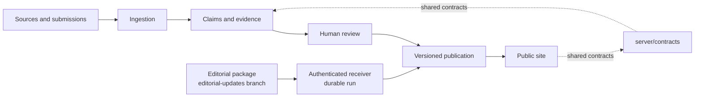

<div align="center">
  <a href="https://lionsofzion.io">
    
  </a>
  <h1>LIONS OF ZION</h1>
  <p><strong>Truth Has a Signal.</strong></p>
  <p>
    An independent evidence network for verified developments, documented sources,<br />
    and the record behind them.
  </p>
  <p>
    <a href="https://lionsofzion.io">Live site</a> ·
    <a href="./docs/README.md">Documentation</a> ·
    <a href="./docs/architecture.md">Architecture</a> ·
    <a href="./docs/operations.md">Operations</a>
  </p>
  <p>
    <a href="https://github.com/lions-admin/lions-of-zion/actions/workflows/ci.yml">
      
    </a>
    
    
    
  </p>
</div>

---

## What this repository contains

Lions of Zion is two deliberately separated systems that share one repository,
build, and deployment:

1. **A public editorial platform** for news and analysis, narrative
   investigation, testimony, documentation, historical context, and source-led
   reporting.
2. **An evidence and publishing backend** that ingests sources, connects
   evidence to claims, preserves version history, and publishes through two
   audited routes: a human one, where a second reviewer approves, and a machine
   one, where an externally composed editorial package is validated,
   authenticated and executed as a durable run.

The boundary is enforced by ESLint import rules rather than convention. Public
code may use the shared vocabulary in `server/contracts/**`; database and policy
code remains inside the server layer.



Every publication carries provenance either way: a human approver who is not
its author, or the editorial run and operation that produced it. A database
trigger refuses a row that claims both, or neither.

## Editorial surfaces

Five destinations. Which one a published record lands on is derived from a
single field, `publication.section`, by `routePublication()` in
`lib/publication-routing.ts` — there is no second placement field anywhere.

| Destination | Route | Purpose |
| --- | --- | --- |
| News & Analysis | [`/geopolitical-brief`](https://lionsofzion.io/geopolitical-brief) | News, the Daily Brief, analysis, and developing stories |
| Fake Resistance | [`/fake-resistance`](https://lionsofzion.io/fake-resistance) | Narratives, claims, disinformation, propaganda, influence networks, antisemitism, and Iranian, Russian and anti-Western investigations |
| The People of Israel | [`/people-of-israel`](https://lionsofzion.io/people-of-israel) | Innovation, science and medicine, AI and technology, agriculture, academia, achievements, international cooperation, the people themselves, and History & Context explainers |
| October 7 | [`/october-7`](https://lionsofzion.io/october-7) | Multilingual testimony and documentation archives, rotating on their own schedule |
| Behind the desk | [`/information-war`](https://lionsofzion.io/information-war) | How AI, research and OSINT become an operating system |

Two collections are preserved inside The People of Israel and keep their
original addresses:

| Collection | Route | Purpose |
| --- | --- | --- |
| Our Heroes | [`/our-heroes`](https://lionsofzion.io/our-heroes) | Sourced records of the fallen, fighters, and rescuers |
| Israel's Story | [`/israels-story`](https://lionsofzion.io/israels-story) | Historical chapters from the founding through wars and treaties |

The October 7 archive is curated. The daily editorial update has no section
that routes there and no homepage area for it, so a run never invents October 7
material.

Readers can also use [search](https://lionsofzion.io/search),
[Ask the desk](https://lionsofzion.io/ask),
[We Are](https://lionsofzion.io/we-are),
[Support Us](https://lionsofzion.io/support-us), the
[methodology](https://lionsofzion.io/methodology), and the public
[corrections record](https://lionsofzion.io/corrections). The retired
`/war-update` route permanently redirects to News & Analysis.

The authenticated `/admin` area is a separate Hebrew, right-to-left operations
workspace for pipeline health, sources, editorial work, incidents, costs,
auditing, access, and system configuration.

## Stack

| Layer | Technology |
| --- | --- |
| Application | Next.js App Router, React, TypeScript |
| UI | Tailwind CSS, CSS Modules, Radix primitives |
| Validation | Zod |
| Data | Neon Postgres, Drizzle ORM |
| Storage | Vercel Blob |
| AI | Vercel AI Gateway with profile-based model routing |
| Background work | Transactional outbox, Vercel Queues, Vercel Cron |
| Testing | Vitest, PGlite, Playwright |
| Deployment | Vercel through the GitHub integration |

## Quick start

### Requirements

- Node.js 24
- npm (the repository is pinned with `package-lock.json`)

### Run the public site

```bash
npm ci
npm run dev
```

Open [http://localhost:3000](http://localhost:3000).

The public frontend and static content run without environment variables. Routes
that read or mutate backend data require the relevant services, beginning with a
pooled Neon `DATABASE_URL`.

### Configure backend features

```bash
cp .env.example .env.local
```

`.env.example` is tracked (`.gitignore` negates it after the `.env*` rule), so
a fresh clone has it. Fill only the variables needed for the feature you are
running. The complete, value-free reference — including what refuses when a
variable is unset — is in [`docs/environment.md`](./docs/environment.md), which
describes the code where the two disagree. Secrets must remain in local or
platform environment storage and must never be committed; the repository is
public.

## Commands

| Command | Purpose |
| --- | --- |
| `npm run dev` | Start the local Next.js development server |
| `npm run typecheck` | Generate route types and run TypeScript with no emit |
| `npm run lint` | Run ESLint and enforce architectural boundaries |
| `npm test` | Run the Vitest suite |
| `npm run build` | Create a production build |
| `npm run verify:changed` | Select checks based on the current diff |
| `npm run verify:full` | Run typecheck, lint, tests, and production build |
| `npm run db:generate` | Generate a new Drizzle migration |
| `npm run db:migrate` | Apply database migrations |
| `npm run sync:start` | Refresh local Git state and report open branches |
| `npm run main:update` | Merge a completed branch into `main` and publish it |
| `npm run editorial:publish -- <file> --dry-run` | Validate an editorial package against `whole-site-update-v1` without sending it |

See [`docs/operations.md`](./docs/operations.md) for focused test commands,
database procedures, the editorial delivery runbook, and troubleshooting.

## Repository map

```text
app/                  Next.js pages and route handlers
components/           Public UI, admin UI, and shared interface primitives
content-packages/     Versioned editorial records and media manifests
lib/                  Public application services and content readers
server/contracts/     Shared, dependency-light domain vocabulary
server/core/          Auth, configuration, outbox, versioning, and AI profiles
server/db/            Drizzle schema, migrations, database client, test harness
server/modules/       Domain services, repositories, and rules
server/jobs/          Background job consumers
scripts/              Operational, migration, verification, and import tools
tests/                Unit, integration, architecture, and content tests
docs/                 System reference and operating procedures
```

## Content and media

Editorial records are committed under `content-packages/`. The October 7 media
archive is intentionally stored outside Git and served through
`NEXT_PUBLIC_ARCHIVE_CDN`; local development can use the documented fallback.

Homepage and editorial media manifests keep source, credit, rights status,
license basis, and focal-point metadata beside each asset. Do not add media
without preserving that provenance.

## Verification and delivery

Pull requests and pushes to `main` run the full CI gate:

```text
npm ci → typecheck → lint → test → build → browser route smoke test
```

GitHub CI validates the repository but does not deploy it.

**Git auto-deploy is connected: a push to `main` reaches Production on its
own**, through the Vercel GitHub integration whose `productionBranch` is
`main`, typically within about two minutes and with no manual step. Two rules
follow. Database migrations required by an application change must be applied
before that change reaches `main` (`npm run db:migrate` against Preview, then
Production, then push); and `vercel rollback` is the fast undo.

The `editorial-updates` and `briefing-packages` branches are excluded from
deployment by `git.deploymentEnabled` in `vercel.json` and by their own
`vercel.json`, so publishing editorial content never rebuilds the site.

## Documentation

| Document | Scope |
| --- | --- |
| [`docs/architecture.md`](./docs/architecture.md) | System map, dependency boundaries, and runtime flows |
| [`docs/api.md`](./docs/api.md) | HTTP routes, authentication, payloads, and errors |
| [`docs/whole-site-updates.md`](./docs/whole-site-updates.md) | The current editorial delivery path: `whole-site-update-v1` packages |
| [`docs/briefing-packages.md`](./docs/briefing-packages.md) | The legacy `external-briefing-v1` compatibility path |
| [`docs/data-model.md`](./docs/data-model.md) | Tables, migrations, triggers, RLS, search, and versioning |
| [`docs/environment.md`](./docs/environment.md) | Environment variable reference without values |
| [`docs/operations.md`](./docs/operations.md) | Local work, CI, deployment, migrations, and troubleshooting |
| [`docs/vercel-infrastructure.md`](./docs/vercel-infrastructure.md) | Verified provider and production infrastructure record |
| [`.ai/DECISIONS.md`](./.ai/DECISIONS.md) | Architecture decision log |

## License

The software is available under the [MIT License](./LICENSE). Editorial content
and third-party media may carry separate rights and attribution requirements;
refer to the relevant content package and media manifest before reuse.
