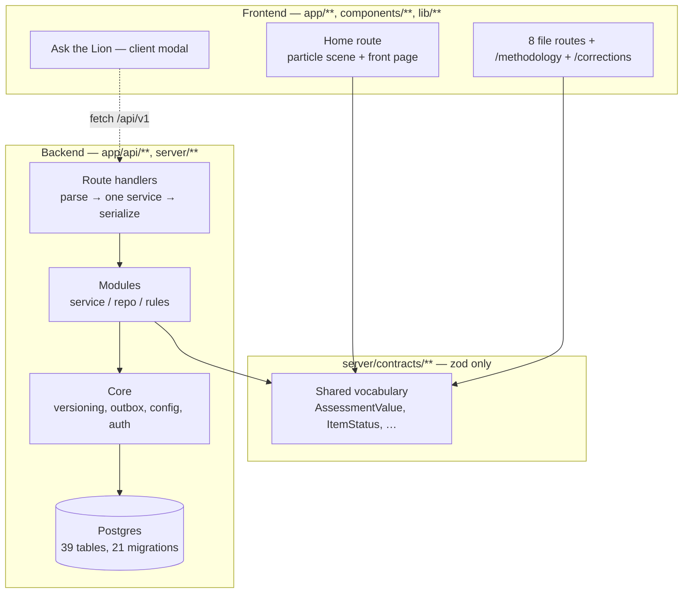
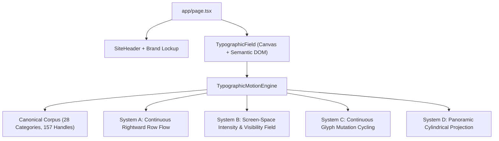
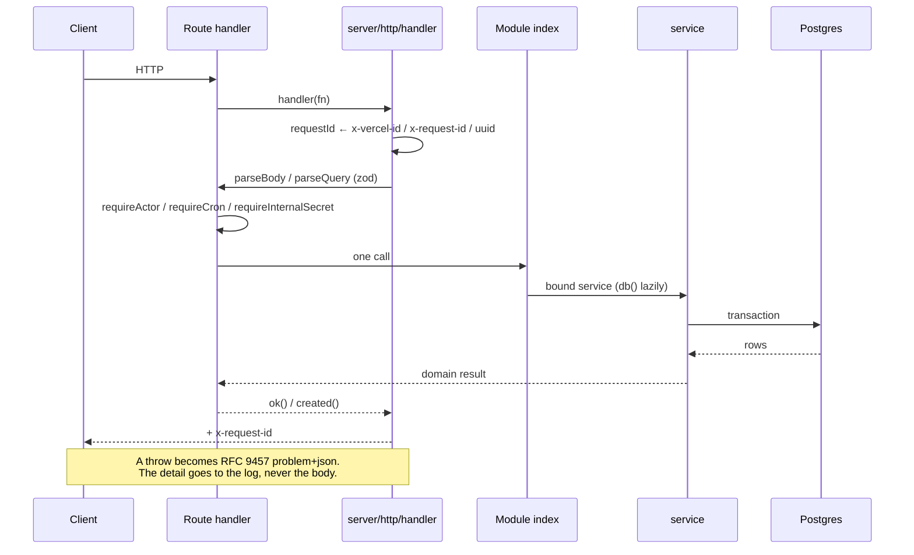
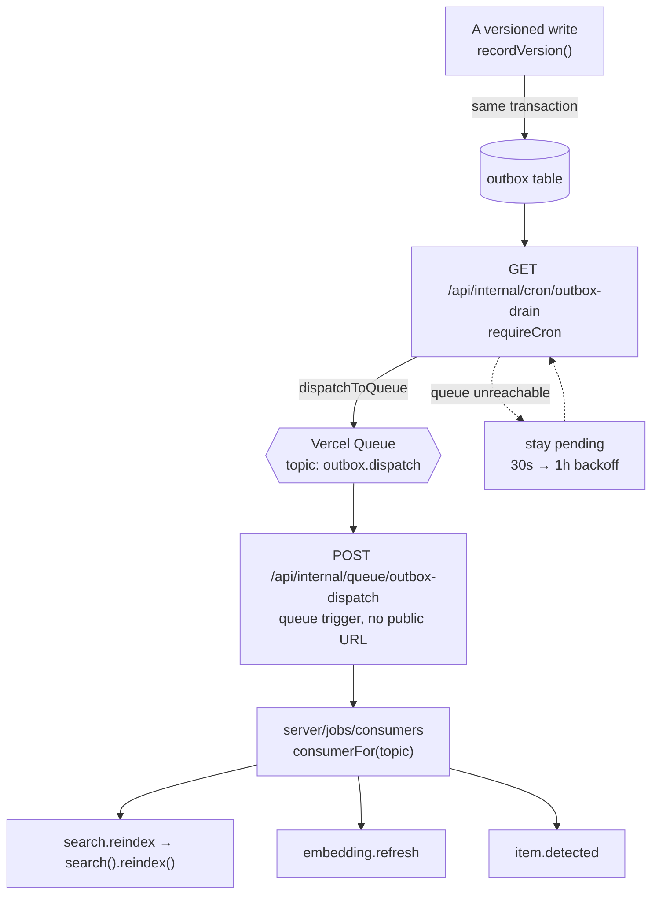
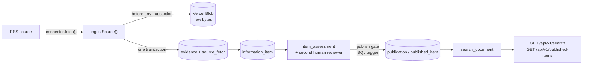

# Architecture

What this system is, how its parts are separated, and which of those
separations are enforced rather than agreed.

Companion documents: [`api.md`](api.md) for the HTTP surface,
[`data-model.md`](data-model.md) for the database, [`environment.md`](environment.md)
for configuration, [`operations.md`](operations.md) for build, CI and deploy.
The **why** behind individual decisions lives in
[`../.ai/DECISIONS.md`](../.ai/DECISIONS.md); this document describes the
shape those decisions produced.

---

## Two halves, one repository

Lions of Zion is two systems that share a repository, a build and a deploy —
and share no source file.

**The experience** is a WebGPU particle site: a story intro that hands off to
a crowned-lion radial navigation over a live network scan, and eight document
routes behind it.

**The information model** is a backend for ingesting sources, attaching
evidence to claims, having a second human review an assessment, and publishing
what survives that.

They are kept apart by lint rules, not by convention. `eslint.config.mjs`
states the boundaries as `no-restricted-imports` errors, so a violation fails
`npm run lint` instead of waiting for a reviewer to notice it.

`server/contracts/**` is the only thing the two halves share. `app/**` and
`components/**` and `lib/**` may import `@/server/contracts/*` and nothing
else under `server/` — which is what keeps a Postgres driver out of the client
bundle.

### The boundaries, as they are actually written

| Layer | May import | May **not** import |
| --- | --- | --- |
| `app/**` (not api), `components/**`, `lib/**` | `@/server/contracts/*` | anything else under `@/server/` |
| `app/api/**` | a module's `index.ts` | `@/server/db*`, a module's `service`/`repo`/`rules`, any component |
| `server/contracts/**` | `zod` | drizzle, `next/*`, `server-only`, anything else in `server/` |
| `server/db/**` | its own schema | `@/server/modules*`, `@/server/http*`, the frontend |
| `server/**` | each other, per above | `@/app/*`, `@/components/*` |
| `server/jobs/**` | module services | `@/server/db*` |

`scripts/**`, `server/db/migrations/**` and `.claude/**` are globally ignored
by ESLint — the last of those because it contains git worktrees, each a full
checkout with its own `node_modules`.

---

## The frontend

### Route map

`lib/site-navigation.ts` `SITE_NAVIGATION` is the **single source of truth**
for the eight destinations. It feeds the home header, reading shell,
`app/sitemap.ts`, and the particle scene's `defaultNodes` projection.
Every node id must have a matching `app/<id>/page.tsx`; `SectionPage` throws
on an unknown id.

| Route | Rendered by | Notes |
| --- | --- | --- |
| `/` | `app/page.tsx` + `CinematicIntroGate` | Editorial signal field beneath a disposable particle entrance |
| `/geopolitical-brief` | `components/briefs/GeopoliticalBrief.tsx` | The one page with its own layout |
| `/support-us` | `SectionPage` | Carries the report and volunteer forms |
| `/war-update` | `SectionPage` | |
| `/october-7` | `SectionPage` | `register="muted"`. A hub: the archives hang beneath it |
| `/october-7/testimonies` + `[slug]` + `[slug]/[locale]` | `DocPage` + `components/archive/` | 505 pages — 179 records, up to 7 languages |
| `/october-7/documentation` + `[category]/[slug]` (+ `[locale]`) | `DocPage` + `components/archive/` | 670 pages — 335 records, English and Spanish |
| `/our-heroes` | `SectionPage` | Opts out of the evidence margin (card grid) |
| `/israels-story` | `SectionPage` | |
| `/fake-resistance` | `SectionPage` | `accent="ember"` |
| `/we-are` | `SectionPage` | |
| `/methodology`, `/corrections` | `components/sections/DocPage.tsx` | Outside `defaultNodes` on purpose |
| `/particle-demo` | own layout | Tuning harness; `disallow`ed in `robots.ts` |

`app/error.tsx` and `app/not-found.tsx` complete the shell. There is
deliberately **no** `app/loading.tsx` — see the note under the home route.

### The home route & Typographic Motion Engine

The editorial home hero is a full-viewport typographic information matrix simulation rendered via `components/typographic-field/`.

The Typographic Motion Engine operates with four independent coordinated systems:
1. **Canonical Corpus (`lib/content/particle-bank.ts`)**: Exactly 28 word/phrase categories and 157 signal handles stored in a typed application data module. All glyph-particles originate strictly from this bank without unapproved filler characters.
2. **System A (Continuous Row Flow)**: ~130–190 tightly packed horizontal rows on desktop moving continuously to the right with wrapping, smooth neighboring velocity variation, and gentle acceleration waves.
3. **System B (Intensity & Visibility Field)**: Independent multi-octave FBM procedural noise field in screen space creating atmospheric depths (5%–30% visibility baseline), diagonal sweeps, and moving high-emphasis highlights.
4. **System C (Character Mutation)**: Deterministic seeded glyph cycling and activity pulses evolving the visual matrix texture within 250ms using only glyphs present in the corpus.
5. **System D (Panoramic Cylindrical Geometry)**: Unified cylindrical arc projection with horizontal edge compression, vertical curve tightening, and soft elliptical attenuation behind the semantic `LIONSOFZION` brand mark.

**`app/page.tsx` is synchronous, and `app/loading.tsx` no longer exists.** A
root-level `loading.tsx` wraps every route in a Suspense boundary; streaming
SSR then emits the real markup inside `
` for an inline
`$RC` script to reveal, so without JavaScript the loading shell stayed and the
page never appeared. The file was deleted on 2026-08-26 and the home route's
prerendered HTML now carries the complete destination beneath a no-JavaScript
rule that hides the cinematic enhancement.

Re-measure the no-JavaScript render before introducing an `await`. **Do not reintroduce a root-level
`loading.tsx`.** See [`../.ai/DECISIONS.md`](../.ai/DECISIONS.md),
"`app/loading.tsx` is removed: it hid every page from readers without
JavaScript", and the earlier entry it supersedes.

### The renderer

`components/particle-nav/Scene.tsx` owns the only live renderer and the only
timeline clock. Its mutable frame is shared by the lion, the TSL story text
and the staged navigation reveal without React state per frame.

Invariants that hold today:

- Every visible mark — scan rows, labels, platform symbols, lion, rings,
  connectors, node icons — is particle geometry. No star field, no raster
  background in the live scene.
- The intro and the navigation share `public/particles/lion-v2-*.bin`; one
  LNP1 bake across both acts, selected at 45k / 90k / 180k by performance tier.
- `OrbitLayout` is the single responsive geometry contract shared by nodes,
  connectors and projected DOM labels.
- The real `<a href>` elements own semantics, pointer input and keyboard
  focus. Canvas elements are presentation only.
- The no-WebGL tier falls back to `public/posters/particle-nav.*` behind those
  same links — there is no second set of fallback links.

`components/intro/` holds only pure timeline data and CPU text-cloud sampling;
it renders nothing.

### The reading shell

`components/sections/SectionPage.tsx` is the dossier shell for seven routes: a
full-width identity band, then a centred 68ch measure. **There is no footer** —
the page ends where the content ends.

Above 1220px both margins work. `SectionToc.tsx` builds an "In this file" rail
on the left by scanning the rendered `h2`s (no per-page data, so it cannot
drift), and each record's citation moves into the right margin beside it.

**The evidence margin is a grid, never absolute positioning.** `marginNote` in
`content.module.css` makes a record's host a two-track grid whose second track
is zero-wide, so a citation taller than its record lengthens its own row
instead of overrunning the next one. A host therefore needs its record and its
sources as *sibling* elements — `.timelineMain`, `.dispatchMain`,
`.caseFileMain`. The citation stays inside its entry in the markup, which is
what keeps reading order, screen readers and the no-JS page correct.

`SectionPage` props: `register` (`default` | `muted`), `accent` (`gold` |
`ember`), `surface` (`default` | `quiet`, used by all seven today), and
`aside` (a page-level right rail, available and currently unused).

`ScanBackdrop` continues the corpus outside the reading band, masked via
`--content-w`. It has two surfaces: `viewport` (fixed, for reading pages) and
`band` (sticky, for the home front page, where `fixed` would paint over the
particle scene above it).

### Content

`lib/content/` is the frontend's content seam — static today, shaped so the
eventual swap to a real published-content query is a change to these function
bodies rather than to any call site.

| Module | Export | Sync/async |
| --- | --- | --- |
| `war-update.ts` | `getWarUpdateEdition()`, `warUpdateEdition` | both |
| `october-7.ts` | `getOctober7Record()`, `october7Record` | both |
| `fake-resistance.ts` | `getFakeResistanceEdition()` | async |
| `israels-story.ts` | `getIsraelsStoryEdition()` | async |
| `our-heroes.ts` | `getOurHeroesEdition()` | async |
| `corrections.ts` | `getCorrectionsLog()` | async |
| `home.ts` | `getLatestMilestone()`, `getRecentMilestones()`, `getTrustStrip()` | **sync, load-bearing** |
| `archive.ts` | `getIndex()`, `getRecord()`, `getMediaRegistry()`, `assetUrl()` | async |
| `testimonies.ts` | `getTestimonyIndex()`, `getTestimony()`, route params | async |
| `documentation.ts` | `getDocumentationGroups()`, `getDocumentationRecord()`, route params | async |

`components/content/` is the shared presentation library the pages are built
from — its own [README](../components/content/README.md) documents every prop.

### The October 7 archive

The three modules above read `content-packages/`, which
`scripts/import-archive-package.mjs` fills from integration packages built to
the `october7-integration-package@1` contract. Four properties are worth
knowing before editing any of it:

- **14 MB of JSON is committed; ~1.8 GB of media never is.** The importer takes
  only each record's `story.json` plus the index, media and translation
  registries — everything else in a package re-aggregates those. Assets resolve
  by `media_id` through `media.json`, so only a URL prefix changes between
  environments (`NEXT_PUBLIC_ARCHIVE_CDN`, else `/archive`).
- **One renderer serves both archives with no branching**, because one's block
  types are a strict subset of the other's. `tests/archive-content.test.ts`
  asserts that rather than trusting it.
- **The bare record route owns the default language and `[locale]` owns the
  rest.** The locale route's `generateStaticParams` deliberately excludes the
  default, so no version ever has two URLs competing for one canonical.
- **Nothing in a record body is a hyperlink**, and credits always render. The
  verifiable pointer travels in the provenance footer and in JSON-LD
  (`isBasedOn`). Both are decisions, not accidents —
  [`../.ai/DECISIONS.md`](../.ai/DECISIONS.md), 2026-08-26.

Full brief: [`archive-integration.md`](archive-integration.md).

---

## The backend

### Request lifecycle

A route handler does three things and no more: parse, call one service,
serialize. Anything resembling a policy decision inside a route file is a bug,
and the lint rules make it a mechanical one.

Every response carries a request id — the same id in the log line, the audit
row and the error body.

### Module shape

Each `server/modules/<name>/` exposes:

- `index.ts` — binds `db()` lazily, memoises, returns the service.
- `service.ts` — the transactional workflow. Owns policy; owns no SQL.
- `repo.ts` — queries.
- `rules.ts` — sometimes. Pure, DB-free policy, unit-tested directly
  (`assessments/rules.ts` is the reference example).

Dependencies that touch the outside world are **constructor parameters, not
imports**: the search service takes an `Embedder`, the chat service takes an
`Answerer` and a `Retriever`, the outbox drain takes a `Dispatcher`. That is
what lets the whole machinery ship and be tested before the AI Gateway or the
queue exists.

Ten modules: `ai`, `assessments`, `chat`, `evidence`, `items`, `narratives`,
`publications`, `reports`, `search`, `sources`.

### Cross-cutting rules worth knowing before editing

- **`server/core/config.ts` is the only runtime file that reads
  `process.env`.** (`drizzle.config.ts`, `server/db/testing.ts` and a
  build-time `NODE_ENV` check in `components/graphics/viewport.ts` also read
  it; none of them is application runtime.) Nothing throws at import time —
  accessors throw at the point of use, naming the variable and what wanted it.
- **`recordVersion()` in `server/core/versioning.ts` is the only write path
  for a versioned entity.** Row update, version row, head pointer, audit trail
  and reindex emit happen in one transaction. Nothing else may `UPDATE` a
  versioned table.
- **`emit()` in `server/core/outbox.ts` writes job intent inside the causing
  transaction.** Publishing to a queue after commit is not atomic; a crash in
  the gap loses the job with no error and no trace.
- **`server/db/client.ts` exports only the WebSocket `neon-serverless`
  driver.** `neon-http` cannot hold an interactive transaction, which makes
  `SET LOCAL ROLE` and `set_config(…, true)` silent no-ops. Do not add it back.
- **Rate limiting counts in Postgres**, not in module scope — Vercel Functions
  are per-region and recycled, so an in-process counter is a limit per
  instance, which under load is no limit at all.
- **Business rules live in SQL triggers as often as in TypeScript.** Status
  transitions, append-only tables, derived columns and the publish gate are
  enforced in `server/db/migrations/`. Changing a rule usually means a new
  numbered migration, not just a service edit.

### Background work

One queue topic, fanned out by the outbox row's own `topic` column — opening a
new kind of background work is "add a case to a registry", not "add a route, a
`vercel.json` trigger, and a redeploy".

The drain is the path that cannot lose a job: it runs with no dependency on
Vercel Queues at all, and a row that fails to dispatch simply stays pending
with a backoff.

### Ingestion → publication

**One connector is registered today: RSS.** `CONNECTORS` in
`server/modules/sources/connectors/index.ts` is a static const array on
purpose — a filesystem scan or a dynamic `import(kind)` would let the bundler
miss a connector entirely, and the failure would only surface in production as
"connector not found" for a source that looked perfectly configured.

The network fetch and the Blob upload happen **before** any transaction opens —
holding a database transaction across either would turn a slow feed into a held
lock. Everything after commits as one unit: a `source_fetch` row whose
`items_new` count does not match what is queryable is worse than no record.

`status` (workflow position) and `assessment` (what we concluded) are
deliberately never collapsed into one axis. An item can be `published` with any
assessment and `under_review` with any; a schema that fuses them makes "we are
still checking" unrepresentable.

---

## Authentication, authorization, caching, state

### Authentication — Neon Auth with a single-admin boundary

`/api/auth/[...path]` proxies Neon Auth and restricts account creation to the
configured `ADMIN_EMAIL`. `authenticateAdmin()` reads the Neon Auth session,
rejects every other email with `FORBIDDEN`, then upserts the matching
`app_user` and its five capability grants. The `/admin` page and admin status
route require that session; public health, search and chat remain the only
open application paths.

Development tests may still register an explicit `x-actor-label` shim. It is
never accepted in Preview or Production. `requireCapability()` checks the
capability set loaded from `capability_grant` and fails closed — but nothing
calls it, deliberately: see the known gaps below and `.ai/DECISIONS.md`.

### Authorization

Two mechanisms exist, at different levels of readiness:

- **Route-level guards.** `requireCron` (Vercel signs every cron invocation
  with `Authorization: Bearer $CRON_SECRET` once the env var exists) and
  `requireInternalSecret` (`x-internal-secret`, for routes Vercel does not
  sign). Deliberately different secrets — reusing one would mean rotating
  either silently breaks the other.
- **Row-level security.** Migration `0015_rls_and_hardening.sql` creates
  `app_public`, `app_staff` and `app_service`, enables RLS on the sensitive
  tables and writes the policies. The test harness exercises them for real
  through `as()`, which opens a transaction, sets the role, and refuses to
  continue unless `current_user` actually changed.

  **The runtime does assume a role, as of 2026-08-27.** This paragraph said the
  opposite — that `setIdentity()` set `app.identity` for audit attribution only
  and the connection ran as the owner, so no policy applied. `server/http/handler.ts`
  now wraps every classified request in `withDatabaseRole(role, identity, invoke)`,
  and `server/db/client.ts` takes a dedicated pooled connection, issues `SET ROLE`
  plus `set_config('app.identity', …)`, and `RESET ROLE` / `RESET ALL` on
  release. Migration `0018` grants the owner membership in the three roles so
  `SET ROLE` succeeds; `0019` adds the policy that lets `INSERT … RETURNING`
  work under `app_public`. The reversal is recorded in
  [`../.ai/DECISIONS.md`](../.ai/DECISIONS.md).

  **The surviving gap is that `withDatabaseRole` has no test.** `tests/rls.test.ts`
  proves the policies with `SET LOCAL ROLE` inside a transaction on PGlite,
  which is not the pooled session-scope mechanism production uses — so the
  mechanism that replaced the untested one is itself untested.

### Caching

- `next.config.ts` sets `Cache-Control: public, max-age=31536000, immutable`
  on `/particles/*` and `/icons/*` — content-addressed bake output.
- Every `/api/**` route declares `runtime = "nodejs"` and
  `dynamic = "force-dynamic"`. Nothing in the API is cached by Next.
- `ScanBackdrop` wraps its corpus read in React `cache()`, deduplicating the
  ~134KB file read per render pass.
- Section and doc pages prerender as static; the `/api` routes are dynamic.
  `npm run build` prints the split.

There is no `unstable_cache`, no `use cache`, no ISR and no revalidation
anywhere in the tree.

### State

- **Server:** Postgres is the only durable store. No Redis, no KV, no
  in-process caches that outlive a request (the module `index.ts` memoisation
  holds a connection pool, not data).
- **Client:** the particle nav's `interactionMachine` plus the intro gate's
  blocking state. The renderer's per-frame state is a mutable object
  outside React entirely, by design.
- **Chat has no client persistence.** `SensitiveContent` deliberately
  remembers nothing between visits.

---

## External services

These services are provisioned for the linked Vercel project. Frontend work
must not silently create additional resources; Preview and Production use
separate data boundaries.

| Service | Used by | Configured via | State |
| --- | --- | --- | --- |
| Neon Postgres | everything under `server/` | `DATABASE_URL` (pooled) | Launch, main + isolated Preview branch |
| Neon Auth | `/api/auth/[...path]`, admin session | `NEON_AUTH_BASE_URL`, `NEON_AUTH_COOKIE_SECRET` | one allowlisted admin |
| Vercel Blob | RSS bytes and archive media | `BLOB_READ_WRITE_TOKEN`, archive-prefixed variables | RSS stores + dedicated archive store |
| Vercel AI Gateway | chat + embeddings | Vercel OIDC in linked Functions | provisioned, $5 Gateway cap |
| Vercel Queues | outbox dispatch | OIDC (`vercel link`, `vercel env pull`) | topic `outbox.dispatch` |
| Vercel Cron | ingest, embed, drain, maintenance | `CRON_SECRET` | four schedules in `vercel.json` |

The queue's absence is not fatal: the drain cron dispatches straight to it and
retries on the next tick if unreachable. Production has the topic configured;
Preview is isolated and cannot write its messages to Production.

Model **profiles** (`fast`, `reasoning`, `translation`, `embedding`) are the
only names application code uses; the provider slugs live in one map in
`server/core/config.ts`. `embedding` is load-bearing — its 1536 dimensions are
baked into `search_document.embedding` as `vector(1536)`, and changing it is a
full table rewrite, so a different embedding model must be added as a second
column rather than swapped into this one.

---

## Known architectural gaps

Verified against the code on 2026-08-26. These are stated here so they are not
rediscovered; none of them is fixed by this document.

1. ~~**RLS is written and tested but not engaged at runtime.**~~ **Closed, and
   this entry was wrong from 2026-08-26 onward.** `server/http/handler.ts`
   calls `withDatabaseRole(access.role, access.identity, invoke)` for every
   request `accessFor()` classifies; it takes a dedicated pooled connection,
   issues `SET ROLE` plus `set_config('app.identity', …)`, and `RESET ALL` on
   release. Migration `0018` grants the owner membership in the three roles so
   `SET ROLE` succeeds. **`PUBLIC_V1` is exactly seven entries** — `GET /search`,
   `GET /published-items`, `POST /reports` and the four chat paths. Everything
   else under `/api/v1/` goes through `authenticateAdmin()` and fails closed,
   so the guard table in [`api.md`](api.md) understates how locked down the
   surface is. **`requireCapability()` is called from nowhere by decision**, not
   by oversight (`.ai/DECISIONS.md`, 2026-08-27): there is one account and
   `authenticateAdmin()` grants it every capability on each sign-in, so a check
   could only ever pass — while adding a way to be locked out. The SQL triggers
   and the `evidence_staff_reads_unrestricted` policy, which reads
   `capability_grant` directly, are what protect those operations.
   `tests/admin-capabilities.test.ts` pins that the owner holds all five; wire
   the check up when a second account exists.
   **One real gap survives inside this one:** `withDatabaseRole` has no
   test: `tests/rls.test.ts` proves the policies through `SET LOCAL ROLE` inside
   a transaction on PGlite, which is not the pooled session-scope mechanism
   production uses.
2. **`.env.example` is not in git** — `.gitignore`'s `.env*` pattern captures
   it. A fresh clone has no environment reference; [`environment.md`](environment.md)
   is the tracked substitute.
3. **`/war-update` and `/we-are` without JavaScript — the stated cause is
   retired, the symptom is unverified.** This gap named "the async render
   reason" — an `await` in the render path landing behind the root
   `app/loading.tsx` Suspense boundary. **That file is deleted**, so the cause
   described here no longer exists and `home.ts`'s synchronous exports are no
   longer load-bearing for it. Whether the two routes still render without
   JavaScript has not been re-measured since. `scripts/final-verify.mjs` is the
   only check that runs with `javaScriptEnabled: false`, and it is
   macOS-workstation-only — **CI cannot see this class of regression at all**
   (see gap 6). Re-measure before either claiming it fixed or acting on it.
4. **`/api/internal/health` has no deep variant**, though `server/core/config.ts`
   refers to one.
5. **Three structural properties, lifted from the 2026-08-26 design audit**
   before it was archived to [`archive/design-audit-2026-08-26.md`](archive/design-audit-2026-08-26.md).
   Most of that audit's 83 findings were downstream of one of them, so they
   outlive the individual fixes:
   - **The archive was attached to the site but never designed into it.** 1,175
     record pages — 57% of the site's routes — render through `DocPage`, whose
     own header says it was written for "short policy pages, not documents with
     sections to navigate". Individually none of the consequences is a bug;
     together they made a majority-of-the-site surface read as generated rather
     than published, which is the opposite of what an evidentiary archive needs
     to project.
   - **The shell's contracts are stated in comments and enforced by nothing.**
     `--content-w` assumed rail widths the grid resolved differently;
     `MOBILE_MAX_WIDTH`'s comment claimed "every layer that asks" while two
     layers hardcoded their own numbers; the reading-progress bar's painted
     default was `scaleX(1)`, so with JavaScript off it reported a document
     fully read. Each was a one-line fix; the pattern — written intent and
     implementation drifting with no test between them — is a maintenance
     property, not a set of accidents.
   - **The type system was collapsed on two axes and left free on the third.**
     `globals.css` declares three faces, seven size steps and six colours — and
     not one spacing token, against 71 distinct rem spacing values across `app/`
     and `components/`.
6. **~~CI cannot guard the no-JavaScript invariant.~~ Closed 2026-08-27** —
   and closed by building both of the Linux-safe fixes this entry proposed.
   `scripts/ci-smoke.mjs` now opens a `javaScriptEnabled: false` context and
   asserts the home route renders at least 8 orbit links, a poster `` and
   **zero** `div[hidden][id^="S:"]` Suspense shells; `tests/no-js-invariant.test.ts`
   is the fast tripwire, and it covers `app/template.tsx` and `app/default.tsx`
   as well as `app/loading.tsx`, since all three wrap every route the same way.
   `scripts/final-verify.mjs` still covers the same ground on the workstation
   but is no longer the sole guard.

   *What remains uncovered:* the no-JS assertion runs against **`/` only**, so a
   content route that acquired its own Suspense boundary would still pass. That
   is a narrower gap than the one this entry described, not the same one.
