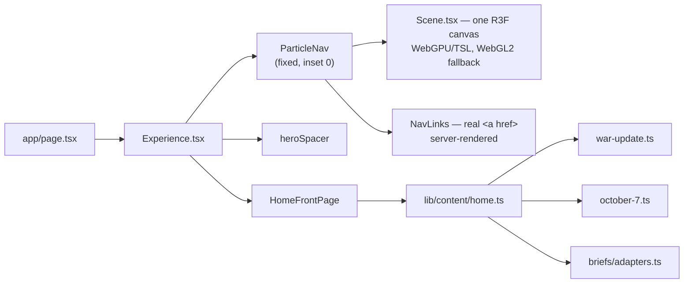
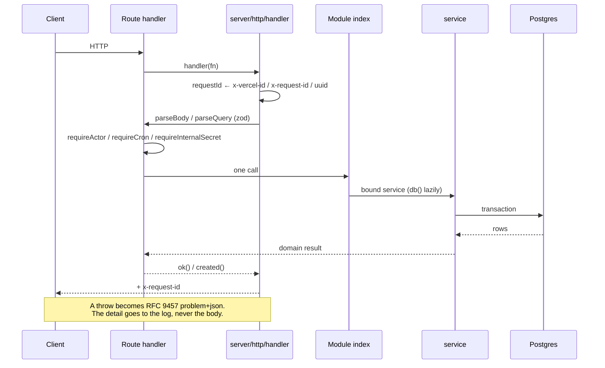
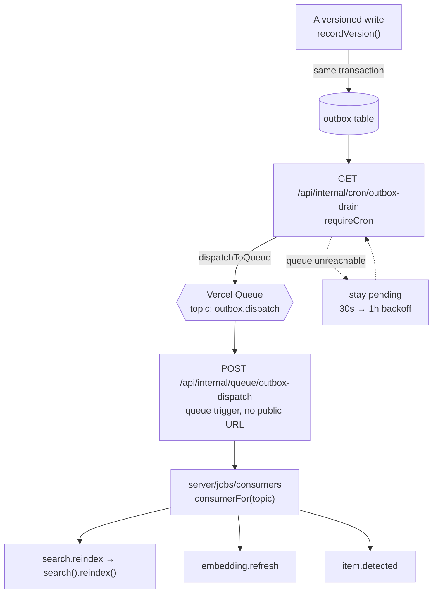
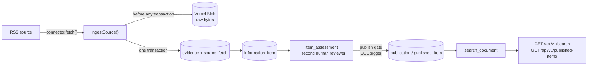

# Architecture

What this system is, how its parts are separated, and which of those
separations are enforced rather than agreed.

Companion documents: [`api.md`](api.md) for the HTTP surface,
[`data-model.md`](data-model.md) for the database, [`environment.md`](environment.md)
for configuration, [`operations.md`](operations.md) for build, CI and deploy.
The **why** behind individual decisions lives in
[`../.ai/DECISIONS.md`](../.ai/DECISIONS.md); this document describes the
shape those decisions produced.

---

## Two halves, one repository

Lions of Zion is two systems that share a repository, a build and a deploy —
and share no source file.

**The experience** is a WebGPU particle site: a story intro that hands off to
a crowned-lion radial navigation over a live network scan, and eight document
routes behind it.

**The information model** is a backend for ingesting sources, attaching
evidence to claims, having a second human review an assessment, and publishing
what survives that.

They are kept apart by lint rules, not by convention. `eslint.config.mjs`
states the boundaries as `no-restricted-imports` errors, so a violation fails
`npm run lint` instead of waiting for a reviewer to notice it.

`server/contracts/**` is the only thing the two halves share. `app/**` and
`components/**` and `lib/**` may import `@/server/contracts/*` and nothing
else under `server/` — which is what keeps a Postgres driver out of the client
bundle.

### The boundaries, as they are actually written

| Layer | May import | May **not** import |
| --- | --- | --- |
| `app/**` (not api), `components/**`, `lib/**` | `@/server/contracts/*` | anything else under `@/server/` |
| `app/api/**` | a module's `index.ts` | `@/server/db*`, a module's `service`/`repo`/`rules`, any component |
| `server/contracts/**` | `zod` | drizzle, `next/*`, `server-only`, anything else in `server/` |
| `server/db/**` | its own schema | `@/server/modules*`, `@/server/http*`, the frontend |
| `server/**` | each other, per above | `@/app/*`, `@/components/*` |
| `server/jobs/**` | module services | `@/server/db*` |

`scripts/**`, `server/db/migrations/**` and `.claude/**` are globally ignored
by ESLint — the last of those because it contains git worktrees, each a full
checkout with its own `node_modules`.

---

## The frontend

### Route map

`components/particle-nav/config.ts` `defaultNodes` is the **single source of
truth** for the eight destinations. It feeds the particle nodes, the DOM
links, the hover cards, the page shell's file numbering, and `app/sitemap.ts`.
Every node id must have a matching `app/<id>/page.tsx`; `SectionPage` throws
on an unknown id.

| Route | Rendered by | Notes |
| --- | --- | --- |
| `/` | `components/Experience.tsx` | Particle scene, then the front-page band |
| `/geopolitical-brief` | `components/briefs/GeopoliticalBrief.tsx` | The one page with its own layout |
| `/support-us` | `SectionPage` | Carries the report and volunteer forms |
| `/war-update` | `SectionPage` | |
| `/october-7` | `SectionPage` | `register="muted"` |
| `/our-heroes` | `SectionPage` | Opts out of the evidence margin (card grid) |
| `/israels-story` | `SectionPage` | |
| `/fake-resistance` | `SectionPage` | `accent="ember"` |
| `/we-are` | `SectionPage` | |
| `/methodology`, `/corrections` | `components/sections/DocPage.tsx` | Outside `defaultNodes` on purpose |
| `/particle-demo` | own layout | Tuning harness; `disallow`ed in `robots.ts` |

`app/error.tsx` and `app/not-found.tsx` complete the shell. There is
deliberately **no** `app/loading.tsx` — see the note under the home route.

### The home route

One `<main>`, two acts. The particle scene keeps `position: fixed; inset: 0`
and the whole first screen; the front-page band scrolls over it.

**`Experience` is synchronous, and `app/loading.tsx` no longer exists.** A
root-level `loading.tsx` wraps every route in a Suspense boundary; streaming
SSR then emits the real markup inside `
` for an inline
`$RC` script to reveal, so without JavaScript the loading shell stayed and the
page never appeared. The file was deleted on 2026-08-26 and the home route's
prerendered HTML now carries its orbit links, band links and poster with zero
Suspense boundaries.

`Experience` and `lib/content/home.ts` remain synchronous, but that is now a
kept default rather than a forced one — re-measure the no-JavaScript render
before introducing an `await`. **Do not reintroduce a root-level
`loading.tsx`.** See [`../.ai/DECISIONS.md`](../.ai/DECISIONS.md),
"`app/loading.tsx` is removed: it hid every page from readers without
JavaScript", and the earlier entry it supersedes.

### The renderer

`components/particle-nav/Scene.tsx` owns the only live renderer and the only
timeline clock. Its mutable frame is shared by the lion, the TSL story text
and the staged navigation reveal without React state per frame.

Invariants that hold today:

- Every visible mark — scan rows, labels, platform symbols, lion, rings,
  connectors, node icons — is particle geometry. No star field, no raster
  background in the live scene.
- The intro and the navigation share `public/particles/lion-v2-*.bin`; one
  LNP1 bake across both acts, selected at 45k / 90k / 180k by performance tier.
- `OrbitLayout` is the single responsive geometry contract shared by nodes,
  connectors and projected DOM labels.
- The real `<a href>` elements own semantics, pointer input and keyboard
  focus. Canvas elements are presentation only.
- The no-WebGL tier falls back to `public/posters/particle-nav.*` behind those
  same links — there is no second set of fallback links.

`components/intro/` holds only pure timeline data and CPU text-cloud sampling;
it renders nothing.

### The reading shell

`components/sections/SectionPage.tsx` is the dossier shell for seven routes: a
full-width identity band, then a centred 68ch measure. **There is no footer** —
the page ends where the content ends.

Above 1220px both margins work. `SectionToc.tsx` builds an "In this file" rail
on the left by scanning the rendered `h2`s (no per-page data, so it cannot
drift), and each record's citation moves into the right margin beside it.

**The evidence margin is a grid, never absolute positioning.** `marginNote` in
`content.module.css` makes a record's host a two-track grid whose second track
is zero-wide, so a citation taller than its record lengthens its own row
instead of overrunning the next one. A host therefore needs its record and its
sources as *sibling* elements — `.timelineMain`, `.dispatchMain`,
`.caseFileMain`. The citation stays inside its entry in the markup, which is
what keeps reading order, screen readers and the no-JS page correct.

`SectionPage` props: `register` (`default` | `muted`), `accent` (`gold` |
`ember`), `surface` (`default` | `quiet`, used by all seven today), and
`aside` (a page-level right rail, available and currently unused).

`ScanBackdrop` continues the corpus outside the reading band, masked via
`--content-w`. It has two surfaces: `viewport` (fixed, for reading pages) and
`band` (sticky, for the home front page, where `fixed` would paint over the
particle scene above it).

### Content

`lib/content/` is the frontend's content seam — static today, shaped so the
eventual swap to a real published-content query is a change to these function
bodies rather than to any call site.

| Module | Export | Sync/async |
| --- | --- | --- |
| `war-update.ts` | `getWarUpdateEdition()`, `warUpdateEdition` | both |
| `october-7.ts` | `getOctober7Record()`, `october7Record` | both |
| `fake-resistance.ts` | `getFakeResistanceEdition()` | async |
| `israels-story.ts` | `getIsraelsStoryEdition()` | async |
| `our-heroes.ts` | `getOurHeroesEdition()` | async |
| `corrections.ts` | `getCorrectionsLog()` | async |
| `home.ts` | `getLatestMilestone()`, `getRecentMilestones()`, `getTrustStrip()` | **sync, load-bearing** |

`components/content/` is the shared presentation library the pages are built
from — its own [README](../components/content/README.md) documents every prop.

---

## The backend

### Request lifecycle

A route handler does three things and no more: parse, call one service,
serialize. Anything resembling a policy decision inside a route file is a bug,
and the lint rules make it a mechanical one.

Every response carries a request id — the same id in the log line, the audit
row and the error body.

### Module shape

Each `server/modules/<name>/` exposes:

- `index.ts` — binds `db()` lazily, memoises, returns the service.
- `service.ts` — the transactional workflow. Owns policy; owns no SQL.
- `repo.ts` — queries.
- `rules.ts` — sometimes. Pure, DB-free policy, unit-tested directly
  (`assessments/rules.ts` is the reference example).

Dependencies that touch the outside world are **constructor parameters, not
imports**: the search service takes an `Embedder`, the chat service takes an
`Answerer` and a `Retriever`, the outbox drain takes a `Dispatcher`. That is
what lets the whole machinery ship and be tested before the AI Gateway or the
queue exists.

Ten modules: `ai`, `assessments`, `chat`, `evidence`, `items`, `narratives`,
`publications`, `reports`, `search`, `sources`.

### Cross-cutting rules worth knowing before editing

- **`server/core/config.ts` is the only runtime file that reads
  `process.env`.** (`drizzle.config.ts`, `server/db/testing.ts` and a
  build-time `NODE_ENV` check in `components/graphics/viewport.ts` also read
  it; none of them is application runtime.) Nothing throws at import time —
  accessors throw at the point of use, naming the variable and what wanted it.
- **`recordVersion()` in `server/core/versioning.ts` is the only write path
  for a versioned entity.** Row update, version row, head pointer, audit trail
  and reindex emit happen in one transaction. Nothing else may `UPDATE` a
  versioned table.
- **`emit()` in `server/core/outbox.ts` writes job intent inside the causing
  transaction.** Publishing to a queue after commit is not atomic; a crash in
  the gap loses the job with no error and no trace.
- **`server/db/client.ts` exports only the WebSocket `neon-serverless`
  driver.** `neon-http` cannot hold an interactive transaction, which makes
  `SET LOCAL ROLE` and `set_config(…, true)` silent no-ops. Do not add it back.
- **Rate limiting counts in Postgres**, not in module scope — Vercel Functions
  are per-region and recycled, so an in-process counter is a limit per
  instance, which under load is no limit at all.
- **Business rules live in SQL triggers as often as in TypeScript.** Status
  transitions, append-only tables, derived columns and the publish gate are
  enforced in `server/db/migrations/`. Changing a rule usually means a new
  numbered migration, not just a service edit.

### Background work

One queue topic, fanned out by the outbox row's own `topic` column — opening a
new kind of background work is "add a case to a registry", not "add a route, a
`vercel.json` trigger, and a redeploy".

The drain is the path that cannot lose a job: it runs with no dependency on
Vercel Queues at all, and a row that fails to dispatch simply stays pending
with a backoff.

### Ingestion → publication

**One connector is registered today: RSS.** `CONNECTORS` in
`server/modules/sources/connectors/index.ts` is a static const array on
purpose — a filesystem scan or a dynamic `import(kind)` would let the bundler
miss a connector entirely, and the failure would only surface in production as
"connector not found" for a source that looked perfectly configured.

The network fetch and the Blob upload happen **before** any transaction opens —
holding a database transaction across either would turn a slow feed into a held
lock. Everything after commits as one unit: a `source_fetch` row whose
`items_new` count does not match what is queryable is worse than no record.

`status` (workflow position) and `assessment` (what we concluded) are
deliberately never collapsed into one axis. An item can be `published` with any
assessment and `under_review` with any; a schema that fuses them makes "we are
still checking" unrepresentable.

---

## Authentication, authorization, caching, state

### Authentication — a deliberate placeholder

`server/core/auth/actor.ts` is **not** authentication and says so. In
development, `x-actor-label` identifies the caller with no verification
whatsoever. **In production it throws `UNAUTHENTICATED`.**

That refusal is the design: a development shim that quietly keeps working once
deployed is how an API ends up with no authentication and nobody noticing.
`requireCapability()` likewise fail-closes with `NOT_IMPLEMENTED` rather than
returning `true`.

Real authentication is Phase 8 and is not built. See
[`api.md`](api.md#authentication) for what that means per route, and
[the gaps section below](#known-architectural-gaps).

### Authorization

Two mechanisms exist, at different levels of readiness:

- **Route-level guards.** `requireCron` (Vercel signs every cron invocation
  with `Authorization: Bearer $CRON_SECRET` once the env var exists) and
  `requireInternalSecret` (`x-internal-secret`, for routes Vercel does not
  sign). Deliberately different secrets — reusing one would mean rotating
  either silently breaks the other.
- **Row-level security.** Migration `0015_rls_and_hardening.sql` creates
  `app_public`, `app_staff` and `app_service`, enables RLS on the sensitive
  tables and writes the policies. The test harness exercises them for real
  through `as()`, which opens a transaction, sets the role, and refuses to
  continue unless `current_user` actually changed.

  **The runtime does not assume a role.** `setIdentity()` sets `app.identity`
  for audit attribution only; nothing in the application issues `SET LOCAL
  ROLE`, so the connection runs as the owner and the policies do not apply.
  This is recorded in [`../.ai/DECISIONS.md`](../.ai/DECISIONS.md).

### Caching

- `next.config.ts` sets `Cache-Control: public, max-age=31536000, immutable`
  on `/particles/*` and `/icons/*` — content-addressed bake output.
- Every `/api/**` route declares `runtime = "nodejs"` and
  `dynamic = "force-dynamic"`. Nothing in the API is cached by Next.
- `ScanBackdrop` wraps its corpus read in React `cache()`, deduplicating the
  ~134KB file read per render pass.
- Section and doc pages prerender as static; the `/api` routes are dynamic.
  `npm run build` prints the split.

There is no `unstable_cache`, no `use cache`, no ISR and no revalidation
anywhere in the tree.

### State

- **Server:** Postgres is the only durable store. No Redis, no KV, no
  in-process caches that outlive a request (the module `index.ts` memoisation
  holds a connection pool, not data).
- **Client:** two React contexts — `ChatOpenProvider` (shared open state
  between `ParticleChatLauncher` and `SectionPage`) and the particle nav's
  `interactionMachine`. The renderer's per-frame state is a mutable object
  outside React entirely, by design.
- **Chat has no client persistence.** `SensitiveContent` deliberately
  remembers nothing between visits.

---

## External services

All three are **optional and currently unprovisioned**. Frontend work must not
silently provision or mutate them.

| Service | Used by | Configured via | State |
| --- | --- | --- | --- |
| Neon Postgres | everything under `server/` | `DATABASE_URL` (pooled) | not provisioned |
| Vercel Blob | `server/core/blob.ts`, ingestion raw bytes | `BLOB_READ_WRITE_TOKEN` | not provisioned |
| Vercel AI Gateway | `server/core/ai/gateway.ts`, chat + embeddings | `AI_GATEWAY_API_KEY` | not provisioned |
| Vercel Queues | outbox dispatch | OIDC (`vercel link`, `vercel env pull`) | not provisioned |

The queue's absence is not fatal: the drain cron dispatches straight to it and
retries on the next tick if unreachable, so ingestion works with only
`DATABASE_URL` and `BLOB_READ_WRITE_TOKEN`.

Model **profiles** (`fast`, `reasoning`, `translation`, `embedding`) are the
only names application code uses; the provider slugs live in one map in
`server/core/config.ts`. `embedding` is load-bearing — its 1536 dimensions are
baked into `search_document.embedding` as `vector(1536)`, and changing it is a
full table rewrite, so a different embedding model must be added as a second
column rather than swapped into this one.

---

## Known architectural gaps

Verified against the code on 2026-08-26. These are stated here so they are not
rediscovered; none of them is fixed by this document.

1. **No cron schedules are configured.** `vercel.json` carries the queue
   trigger and nothing else — there is no `crons` array, so
   `/api/internal/cron/ingest`, `/embed` and `/outbox-drain` will never fire
   in production. See [`operations.md`](operations.md#scheduled-work).
2. **RLS is written and tested but not engaged at runtime** (above).
3. **The public chat cannot work in production as written.** `AskTheLionChat`
   probes with an anonymous `GET /api/v1/chat/threads`, but `POST` calls
   `requireActor`, which throws in production. With a database provisioned the
   probe would report "online" and every message would fail.
4. **`.env.example` is not in git** — `.gitignore`'s `.env*` pattern captures
   it. A fresh clone has no environment reference; [`environment.md`](environment.md)
   is the tracked substitute.
5. **`/war-update` and `/we-are` are blank without JavaScript**, for the async
   render reason described under [the home route](#the-home-route). Recorded in
   `lib/content/home.ts`'s own header.
6. **`/api/internal/health` has no deep variant**, though `server/core/config.ts`
   refers to one.
