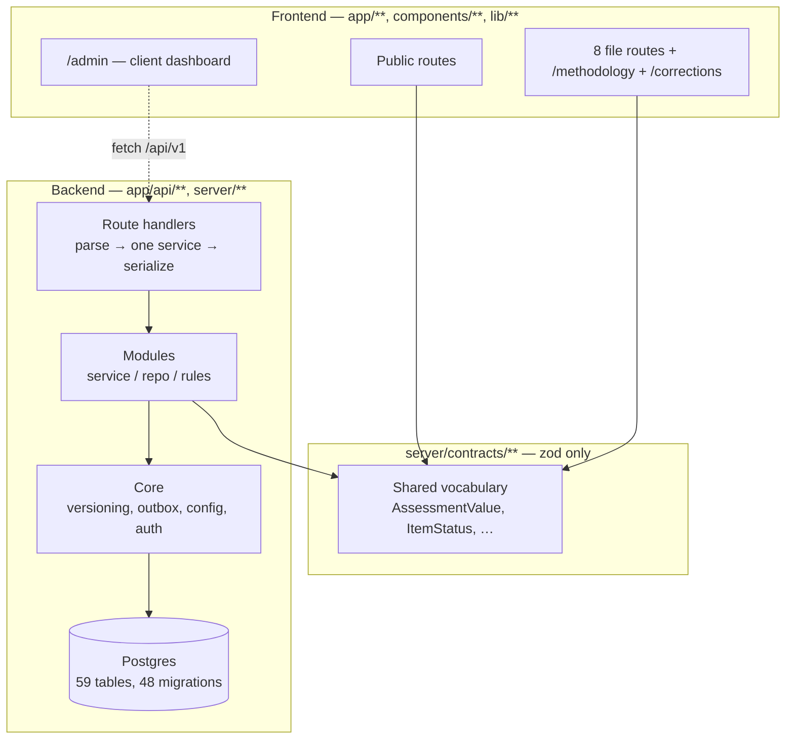
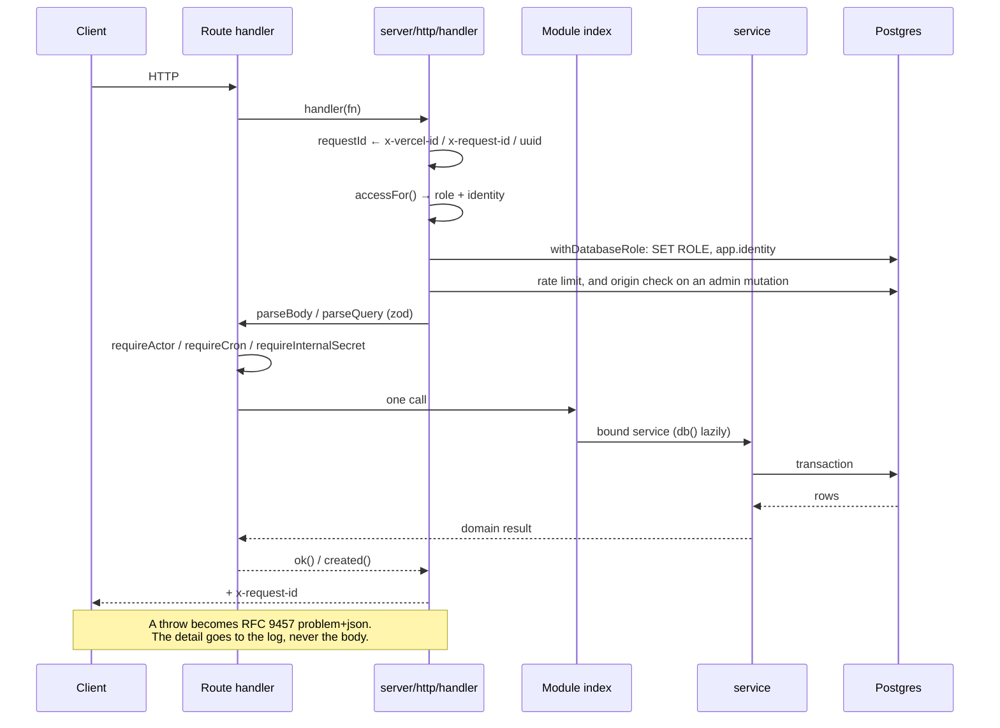
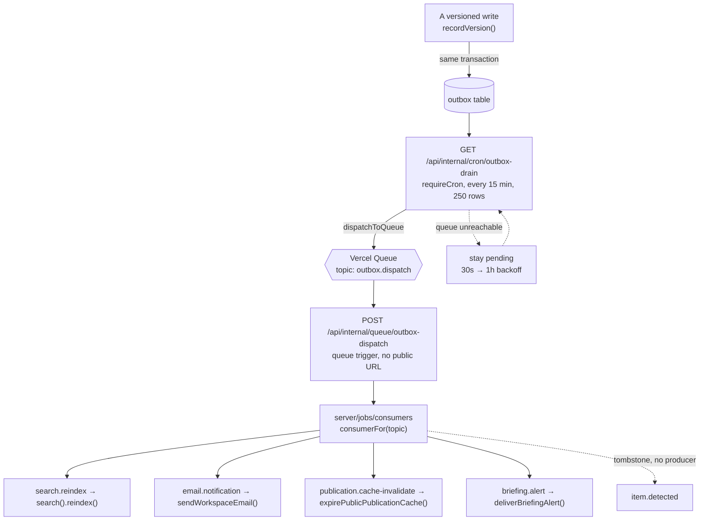
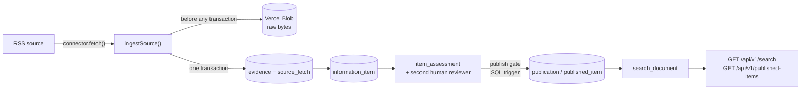
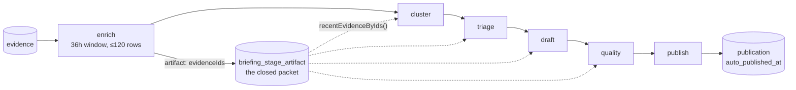

# Architecture

What this system is, how its parts are separated, and which of those
separations are enforced rather than agreed.

Companion documents: [`api.md`](api.md) for the HTTP surface,
[`data-model.md`](data-model.md) for the database, [`environment.md`](environment.md)
for configuration, [`operations.md`](operations.md) for build, CI and deploy.
The **why** behind individual decisions lives in
[`../.ai/DECISIONS.md`](../.ai/DECISIONS.md); this document describes the
shape those decisions produced.

---

## Two halves, one repository

Lions of Zion is two systems that share a repository, a build and a deploy, and
that meet at exactly two seams: the shared vocabulary in `server/contracts/**`,
and one server-only reader, `lib/publications.ts`, through which the site
renders published articles.

**The public application** lives under `app/`, `components/`, and `lib/`.

**The information model** is a backend for ingesting sources, attaching
evidence to claims, having a second human review an assessment, and publishing
what survives that.

They are kept apart by lint rules, not by convention. `eslint.config.mjs`
states the boundaries as `no-restricted-imports` errors, so a violation fails
`npm run lint` instead of waiting for a reviewer to notice it.



`app/**` and `components/**` and `lib/**` may import `@/server/contracts/*` and
nothing else under `server/` — which is what keeps a Postgres driver out of the
client bundle.

The one carve-out is written as an inline `eslint-disable` rather than a rule in
`eslint.config.mjs`, so it is easy to miss: `lib/publications.ts` imports
`@/server/modules/publications` and `withDatabaseRole` directly. It is
`server-only`, and the alternative is worse — a server component fetching the
project's own public API self-fetches over the network at render time and has to
guess its own origin. Nothing else in `lib/**` may follow it.

### The boundaries, as they are actually written

| Layer | May import | May **not** import |
| --- | --- | --- |
| `app/**` (not api), `components/**`, `lib/**` | `@/server/contracts/*` | anything else under `@/server/` |
| `app/api/**` | a module's `index.ts` | `@/server/db*`, a module's `service`/`repo`/`rules`, any component |
| `server/contracts/**` | `zod` | drizzle, `next/*`, `server-only`, anything else in `server/` |
| `server/db/**` | its own schema | `@/server/modules*`, `@/server/http*`, the frontend |
| `server/**` | each other, per above | `@/app/*`, `@/components/*` |
| `server/jobs/**` | module services | `@/server/db*` |

`scripts/**`, `server/db/migrations/**` and `.claude/**` are globally ignored
by ESLint — the last of those because it contains git worktrees, each a full
checkout with its own `node_modules`.

---


## The backend

### Request lifecycle



A route handler does three things and no more: parse, call one service,
serialize. Anything resembling a policy decision inside a route file is a bug,
and the lint rules make it a mechanical one.

Every response carries a request id — the same id in the log line, the audit
row and the error body.

### Module shape

Each `server/modules/<name>/` exposes:

- `index.ts` — binds `db()` lazily, memoises, returns the service.
- `service.ts` — the transactional workflow. Owns policy; owns no SQL.
- `repo.ts` — queries.
- `rules.ts` — sometimes. Pure, DB-free policy, unit-tested directly
  (`assessments/rules.ts` is the reference example).

Dependencies that touch the outside world are **constructor parameters, not
imports**: the search service takes an `Embedder`, the chat service takes an
`Answerer` and a `Retriever`, the outbox drain takes a `Dispatcher`, and the
briefing service takes a `Generator`. That is what lets the whole machinery
ship and be tested before the AI Gateway or the queue exists.

Fourteen modules. Eleven carry the full shape — `ai`, `assessments`,
`briefing`, `chat`, `evidence`, `items`, `narratives`, `publications`,
`reports`, `search`, `sources`. Three are deliberately smaller, and it is worth
knowing which, so nobody goes looking for a `repo.ts` that was never meant to
exist:

- `outbox` is one function, `dispatchOutboxMessage`. It owns the service
  identity a queued message executes under, so the queue route authenticates
  the callback and does nothing else.
- `public-auth` has a service and no repo.
- `public-x-auth` is a pure re-export facade over `core/auth/public-x.ts` —
  no service, no repo, no database. It exists so `app/auth/**/route.ts` can
  reach that code under a carve-out in `eslint.config.mjs`.

`briefing` has six files rather than four. `quality.ts` is `rules.ts` under
another name — pure, DB-free, unit-tested directly. `jobs.ts` and `alerts.ts`
are the extras: the queued stage runner and the operator alert path.

### Cross-cutting rules worth knowing before editing

- **`server/core/config.ts` is the only server-runtime file that reads
  `process.env`.** Nothing throws at import time — accessors throw at the point
  of use, naming the variable and what wanted it. Five other files read it and
  none is server runtime: `drizzle.config.ts`, `server/db/testing.ts`,
  `next.config.ts`, and two frontend modules reading a `NEXT_PUBLIC_*` name
  that Next substitutes at build time rather than reads at runtime —
  `lib/content/archive.ts` (`NEXT_PUBLIC_ARCHIVE_CDN`) and
  `components/auth/google-identity.ts`
  (`NEXT_PUBLIC_GOOGLE_IDENTITY_CLIENT_ID`).
- **`recordVersion()` in `server/core/versioning.ts` is the only write path
  for a versioned entity.** Row update, version row, head pointer, audit trail
  and reindex emit happen in one transaction. Nothing else may `UPDATE` a
  versioned table.
- **`emit()` in `server/core/outbox.ts` writes job intent inside the causing
  transaction.** Publishing to a queue after commit is not atomic; a crash in
  the gap loses the job with no error and no trace.
- **`server/db/client.ts` exports only the WebSocket `neon-serverless`
  driver.** `neon-http` cannot hold an interactive transaction, which makes
  `SET LOCAL ROLE` and `set_config(…, true)` silent no-ops. Do not add it back.
- **Rate limiting counts in Postgres**, not in module scope — Vercel Functions
  are per-region and recycled, so an in-process counter is a limit per
  instance, which under load is no limit at all.
- **Business rules live in SQL triggers as often as in TypeScript.** Status
  transitions, append-only tables, derived columns and the publish gate are
  enforced in `server/db/migrations/`. Changing a rule usually means a new
  numbered migration, not just a service edit.

### Background work



One queue topic for the outbox, fanned out by the row's own `topic` column —
opening a new kind of background work is "add a case to a registry", not "add a
route, a `vercel.json` trigger, and a redeploy". The briefing pipeline is the
deliberate exception: its stages *are* separate routes with separate triggers,
because each one needs its own `maxDuration` and its own retry interval.

The drain is the path that cannot lose a job: it runs with no dependency on
Vercel Queues at all, and a row that fails to dispatch simply stays pending
with a backoff.

**`TOPICS` in `server/core/outbox.ts` is the whole list, and `item.detected` is
not in it.** A reader who finds a consumer with no producer should know that is
deliberate. Retiring a topic is two deploys, not one: the producers go and the
topic moves into `RETIRED_TOPICS`, which `emit()` does not accept — so naming it
again is a type error rather than a convention someone has to remember — while
its consumer stays registered as a tombstone. It has to. Rows written before the
change may still be undrained in a real database, and `dispatchOutboxMessage`
throws on an unregistered topic, so a queue message for one would retry against
that throw until the queue gave up. The consumer and the `RETIRED_TOPICS` entry
are deleted together, once

```sql
SELECT count(*) FROM outbox WHERE topic = 'item.detected' AND published_at IS NULL
```

reads 0 in Production and the queue has no message left in flight.

`embedding.refresh` was removed outright rather than retired, because the git
history shows no commit ever emitted it: it was a Phase-6 placeholder, so there
can be no undrained row to acknowledge.

**The drain limit is a throughput, and it is sized by the briefing edition.**
`DEFAULT_DRAIN_LIMIT` is 250; the cron runs every 15 minutes, so that is 1,000
rows an hour. One edition materializes roughly a claim per paragraph and emits
a `search.reindex` for each — about 190 rows arriving at once. At the previous
limit of 25 that took eight ticks, so a story published at 05:00 was not
searchable until nearly 07:00. At 250 it drains on the first tick with room for
a double-length edition and whatever ordinary traffic accumulated alongside it.
The ceiling is the route's `maxDuration = 60`: each row costs one queue `send`
and one single-row `UPDATE`, so 250 finishes well inside the budget even at a
pessimistic 150ms a row. Overshooting is not destructive either, since
`published_at` commits per row and the next tick resumes from where a timeout
stopped.

### Ingestion → publication



**One connector is registered today: RSS.** `CONNECTORS` in
`server/modules/sources/connectors/index.ts` is a static const array on
purpose — a filesystem scan or a dynamic `import(kind)` would let the bundler
miss a connector entirely, and the failure would only surface in production as
"connector not found" for a source that looked perfectly configured.

The network fetch and the Blob upload happen **before** any transaction opens —
holding a database transaction across either would turn a slow feed into a held
lock. Everything after commits as one unit: a `source_fetch` row whose
`items_new` count does not match what is queryable is worse than no record.

`status` (workflow position) and `assessment` (what we concluded) are
deliberately never collapsed into one axis. An item can be `published` with any
assessment and `under_review` with any; a schema that fuses them makes "we are
still checking" unrepresentable.

### The briefing pipeline

The path above is the human one: a reviewer approves an assessment and the
publish gate checks that the approver is a person other than the author. There
is a second path to the same `publication` table, and it publishes without a
human at all.



`PIPELINE_STAGES` in `server/modules/briefing/service.ts` is the list, and each
stage is a separate run with its own `vercel.json` queue topic — `briefing-enrich`
through `briefing-publish`, plus a seventh, `briefing-collect`, which fans out
per source ahead of them. Splitting it that way is what makes an edition
resumable and what makes a stage retryable without redoing the model calls
before it, but it also means **the stages of one edition can straddle a
deploy**, which shapes several things that otherwise look like clutter.

- **The packet is closed at `enrich` and read by id afterwards.** The enrich
  stage writes an artifact naming its `evidenceIds`; `evidenceForArtifact()`
  re-reads exactly that set through `recentEvidenceByIds()`. Cluster, triage,
  draft and quality all call it. The obvious alternative — re-open the time
  window and filter in memory — is not merely more expensive, it is wrong: it
  drops rows whenever the edition is processed outside the window (a retry the
  next day) or the day produced more rows than the limit, and the loss is
  silent right up until `validateDraftEvidence` throws on an id the model was
  legitimately given.
- **What the model sees is a truncation of what the checks read.**
  `sourcePacket()` cuts each excerpt to 1,200 characters; a stored excerpt runs
  to 6,000 and up to 120 rows are sent at triage, which is the single largest
  item in the daily token bill and far more text than a selection decision
  needs. The quality gate still matches the drafted article against the whole
  stored excerpt, so the check corpus stays a superset of what the model saw —
  the direction that cannot launder a fabrication.
- **`STORED_ARTICLE_SECTIONS` is wider than `ARTICLE_SECTIONS`** for the same
  straddling reason: an artifact written while `war_update` was still selectable
  must still parse on the way back in, or the edition quarantines for no
  editorial reason at all.

The edition serves three jobs, declared in priority order in the triage prompt:
refute anti-Israel narratives, publish one regional geopolitical Daily Brief,
and publish one genuinely interesting Israel story. Security, war and
operational material feeds the Daily Brief rather than becoming a standalone
article — which is why `war_update` was removed from `ARTICLE_SECTIONS` and why
`/war-update` now serves an archive that does not grow. The value stays legal in
`PUBLICATION_SECTIONS` and in the Postgres enum, so historic rows and homepage
eligibility are untouched.

Rows arriving through the **external composer ingest**
(`POST /api/internal/briefing/external-publish`) must pass every deterministic
check in `briefing/quality.ts` — `evaluateCandidate()` at
`external-publish.ts:265` is the one call site. Count the checks at the source;
this paragraph said "eighteen" against an array of seventeen until 2026-09-05.

⚠️ **That is the only path with a deterministic gate.** This section described
"two places that count differently" until 2026-09-05, and both had been removed
on 2026-09-03: migration `0049` replaced the trigger's count with a machine-
provenance check, and `595ca9d` deleted the counter from `publications/repo.ts`.
The **internal** pipeline (`enrich → cluster → triage → draft → publish`, still
wired in `vercel.json`, still reachable through `POST /api/v1/admin/briefing/run`)
publishes with **no quality check at all**. Whether it should call
`evaluateCandidate` before `publish` is an open owner decision — `0049` retired
the stage by owner instruction. See [`data-model.md`](data-model.md#the-publish-gate).

One Narrative Watch record per edition may publish **citing nothing at all**,
marked in public as this organisation's own analysis rather than as documented
fact. Structurally that is a flag inside a jsonb column and a second branch
inside several of the checks — never a skipped check. Where the flag
comes from, why it is derived rather than chosen, and why an absent value must
read as "sourced" are in
[`data-model.md`](data-model.md#the-narrative_watch_details-jsonb).

Full brief: [`GEOPOLITICAL_BRIEF_AUTOMATION.md`](GEOPOLITICAL_BRIEF_AUTOMATION.md);
operations in [`briefing-operations.md`](briefing-operations.md).

---

## Authentication, authorization, caching, state

### Authentication — Neon Auth with a single-admin boundary

`/api/auth/[...path]` proxies Neon Auth and restricts account creation to the
configured `ADMIN_EMAIL`. `authenticateAdmin()` reads the Neon Auth session,
rejects every other email with `FORBIDDEN`, then upserts the matching
`app_user` and its five capability grants. The `/admin` page and admin status
route require that session.

What is open is the `PUBLIC_V1` list in `server/http/handler.ts` — **nine
entries**: `GET /search`, `GET /published-items`,
`GET /published-publications` and its `/{publicId}`, `POST /reports`,
`POST /volunteer-interest`, and the four chat paths. Anything else under
`/api/v1/` goes through `authenticateAdmin()` and fails closed. `accessFor()`
classifies only `/api/v1/` and the internal cron and queue prefixes, so
`/api/internal/health` and the `/api/public-auth/*` and `/api/auth/*` routes
are outside the role machinery entirely and carry their own guards.

Development tests may still register an explicit `x-actor-label` shim. It is
never accepted in Preview or Production. `requireCapability()` checks the
capability set loaded from `capability_grant` and fails closed — but nothing
calls it, deliberately: see the known gaps below and `.ai/DECISIONS.md`.

### Authorization

Two mechanisms exist, at different levels of readiness:

- **Route-level guards.** `requireCron` (Vercel signs every cron invocation
  with `Authorization: Bearer $CRON_SECRET` once the env var exists) and
  `requireInternalSecret` (`x-internal-secret`, for routes Vercel does not
  sign). Deliberately different secrets — reusing one would mean rotating
  either silently breaks the other.
- **Row-level security.** Migration `0015_rls_and_hardening.sql` creates
  `app_public`, `app_staff` and `app_service`, enables RLS on the sensitive
  tables and writes the policies. The test harness exercises them for real
  through `as()`, which opens a transaction, sets the role, and refuses to
  continue unless `current_user` actually changed.

  **The runtime does assume a role, as of 2026-08-27.** This paragraph said the
  opposite — that `setIdentity()` set `app.identity` for audit attribution only
  and the connection ran as the owner, so no policy applied. `server/http/handler.ts`
  now wraps every classified request in `withDatabaseRole(role, identity, invoke)`,
  and `server/db/client.ts` takes a dedicated pooled connection, issues `SET ROLE`
  plus `set_config('app.identity', …)`, and `RESET ROLE` / `RESET ALL` on
  release. Migration `0018` grants the owner membership in the three roles so
  `SET ROLE` succeeds; `0019` adds the policy that lets `INSERT … RETURNING`
  work under `app_public`. The reversal is recorded in
  [`../.ai/DECISIONS.md`](../.ai/DECISIONS.md).

  **The surviving gap is that `withDatabaseRole` has no test.** `tests/rls.test.ts`
  proves the policies with `SET LOCAL ROLE` inside a transaction on PGlite,
  which is not the pooled session-scope mechanism production uses — so the
  mechanism that replaced the untested one is itself untested.

### Caching

- `next.config.ts` sets `Cache-Control: public, max-age=31536000, immutable`
  on `/particles/*` and `/icons/*` — content-addressed bake output.
- Every one of the 66 `/api/**` routes declares `runtime = "nodejs"`, and every
  one that answers a `GET` also declares `dynamic = "force-dynamic"`. Nothing in
  the API is cached by Next. The eight without it are the queue-trigger routes,
  which are `POST`-only.
- `ScanBackdrop` wraps its corpus read in React `cache()`, deduplicating the
  ~134KB file read per render pass.
- Section and doc pages prerender as static; the `/api` routes are dynamic.
  `npm run build` prints the split.

On the page side, **published articles are the one cached read, and they are
cached three deep.**
`lib/publications.ts` wraps each public projection in `unstable_cache` with the
`publications` tag and a 300-second `revalidate`, then wraps *that* in
`publicReadCache` (a module-scope map with a 5-minute TTL) and in
`withLastGoodRead` (a 24-hour recovery cache that returns the last complete read
if the database is unreachable, and rethrows otherwise). Each layer answers a
different failure: Next's cache spans instances, the module map survives a
`revalidate` miss inside one instance, and the last-good read is what stops a
Neon blip from turning the front page into an error. The whole stack is expired
by `expirePublicPublicationCache()`, which the `publication.cache-invalidate`
outbox consumer calls — and which route handlers also call directly after an
admin edit commits, because a reader should not wait for a queue tick to stop
seeing a story that was just archived.

### State

- **Server:** Postgres is the only durable store. No Redis, no KV. Two
  in-process caches outlive a request, both described above and both derivable
  from Postgres: `public-read-cache.ts` and `last-good-read.ts`. Losing either
  costs a re-read, never a fact. (The module `index.ts` memoisation holds a
  connection pool, not data.)
- **Client:** the particle nav's `interactionMachine` plus the intro gate's
  blocking state. The renderer's per-frame state is a mutable object
  outside React entirely, by design.
- **Chat has no client persistence** — and no client surface either: the four
  chat routes under `/api/v1/chat` are live and public, but nothing in
  `app/**` or `components/**` calls them.

---

## External services

These services are provisioned for the linked Vercel project. Frontend work
must not silently create additional resources; Preview and Production use
separate data boundaries.

| Service | Used by | Configured via | State |
| --- | --- | --- | --- |
| Neon Postgres | everything under `server/` | `DATABASE_URL` (pooled) | Launch, main + isolated Preview branch |
| Neon Auth | `/api/auth/[...path]`, admin session | `NEON_AUTH_BASE_URL`, `NEON_AUTH_COOKIE_SECRET` | one allowlisted admin |
| Vercel Blob | RSS bytes and archive media | `BLOB_READ_WRITE_TOKEN`, archive-prefixed variables | RSS stores + dedicated archive store |
| Vercel AI Gateway | chat, embeddings, briefing triage and draft | Vercel OIDC in linked Functions | provisioned, $5 Gateway cap |
| Vercel Queues | outbox dispatch, briefing stages | OIDC (`vercel link`, `vercel env pull`) | `outbox.dispatch` + `briefing-collect` and one topic per pipeline stage |
| Vercel Cron | ingest, embed, drain, maintenance, briefing | `CRON_SECRET` | five schedules in `vercel.json` |

The queue's absence is not fatal for the outbox: the drain cron dispatches
straight to it and retries on the next tick if unreachable. Production has the
topics configured; Preview is isolated and cannot write its messages to
Production — and `runStage` refuses outright when `appEnv()` is `preview`, so a
Preview deploy cannot spend Gateway budget or publish an edition.

Model **profiles** (`fast`, `reasoning`, `translation`, `briefingTriage`,
`briefingDraft`, `embedding`) are the only names application code uses; the
provider slugs live in one map in `server/core/config.ts`. The briefing stages
have their own two profiles rather than borrowing `fast` and `reasoning`,
because those two are also what chat runs on — a model swap made for the chat
answer should not silently change what an edition drafts.
`embedding` is load-bearing — its 1536 dimensions are
baked into `search_document.embedding` as `vector(1536)`, and changing it is a
full table rewrite, so a different embedding model must be added as a second
column rather than swapped into this one.

---

## Known architectural gaps

Verified against the code on 2026-09-01. These are stated here so they are not
rediscovered; none of them is fixed by this document.

1. ~~**RLS is written and tested but not engaged at runtime.**~~ **Closed, and
   this entry was wrong from 2026-08-26 onward.** `server/http/handler.ts`
   calls `withDatabaseRole(access.role, access.identity, invoke)` for every
   request `accessFor()` classifies; it takes a dedicated pooled connection,
   issues `SET ROLE` plus `set_config('app.identity', …)`, and `RESET ALL` on
   release. Migration `0018` grants the owner membership in the three roles so
   `SET ROLE` succeeds. **`PUBLIC_V1` is exactly nine entries** — `GET /search`,
   `GET /published-items`, `GET /published-publications` and its `/{publicId}`,
   `POST /reports`, `POST /volunteer-interest`, and the four chat paths.
   Everything else under `/api/v1/` goes through `authenticateAdmin()` and fails
   closed, so the guard table in [`api.md`](api.md) understates how locked down
   the surface is. **`requireCapability()` is called from nowhere by decision**, not
   by oversight (`.ai/DECISIONS.md`, 2026-08-27): there is one account and
   `authenticateAdmin()` grants it every capability on each sign-in, so a check
   could only ever pass — while adding a way to be locked out. The SQL triggers
   and the `evidence_staff_reads_unrestricted` policy, which reads
   `capability_grant` directly, are what protect those operations.
   `tests/admin-capabilities.test.ts` pins that the owner holds all five; wire
   the check up when a second account exists.
   **One real gap survives inside this one:** `withDatabaseRole` has no
   test: `tests/rls.test.ts` proves the policies through `SET LOCAL ROLE` inside
   a transaction on PGlite, which is not the pooled session-scope mechanism
   production uses.
2. **`.env.example` is not in git** — `.gitignore`'s `.env*` pattern captures
   it. A fresh clone has no environment reference; [`environment.md`](environment.md)
   is the tracked substitute.
3. ~~**`/api/internal/health` has no deep variant.**~~ **Closed** —
   `deepHealth()` in `server/core/deep-health.ts` is served by
   `GET /api/v1/admin/health/deep` behind `requireActor`, which is where a
   dependency probe belongs: `/api/internal/health` stays deliberately shallow
   so a degraded dependency does not make the deployment look dead to the
   platform's rollout gate. What survives is a stale comment — the
   configuration summary in `server/core/config.ts` still points readers at
   `/api/internal/health/deep`, a path that does not exist.
