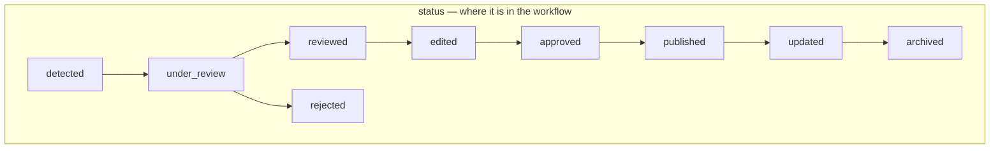
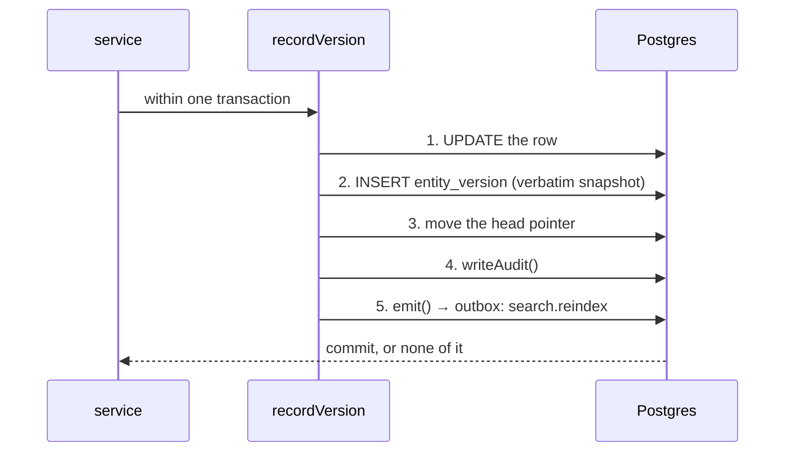

# Data model

Postgres, via Drizzle. **39 tables, 1 view, 25 SQL functions, 25 triggers,
21 numbered migrations.**

Schema definitions live in `server/db/schema/` and are the source drizzle-kit
generates from. Rules that Drizzle cannot express live in hand-written SQL in
`server/db/migrations/` — and a large share of this system's business logic is
there rather than in TypeScript.

---

## The rule that shapes everything else

**Business rules live in SQL triggers as often as in TypeScript.** Status
transitions, append-only tables, derived columns and the publish gate are all
enforced in the database. Changing a rule usually means a new numbered
migration, not just a service edit.

The reason is blunt: a service is one caller. A trigger is every caller,
including a console session, a migration script, and the next service somebody
writes without reading this file.

---

## Migrations

Checked in, applied in **filename order** — by the test harness against
PGlite, and by `db:migrate` against Neon. Same files, same order, both places,
so a trigger cannot be present in one and missing in the other.

Even-numbered files are usually drizzle-generated structure; odd-numbered ones
are the hand-written rules for the phase before them.

| File | What it adds |
| --- | --- |
| `0000_core` | Identity, audit, versioning, outbox, taxonomy |
| `0001_append_only_and_privilege` | The rules Drizzle cannot express |
| `0002_information_model` | `information_item` and its relations |
| `0003_item_rules` | Status legality, the append-only transition trail |
| `0004_sources_and_evidence` | `source`, `source_family`, `source_fetch`, `evidence` |
| `0005_sources_and_evidence_rules` | Append-only for the two logs |
| `0006_evidence_and_assessments` | `item_evidence`, `item_assessment`, `review_queue` |
| `0007_evidence_and_assessment_rules` | Assessment immutability, derived columns, the publish gate, the `published_item` view |
| `0008_search_documents` | `search_document`, trigram index |
| `0009_search_hybrid` | `search_hybrid()` — retrieval fused in one function |
| `0010_ai_runs_and_suggestions` | `ai_run`, `ai_suggestion`, `prompt_registry` |
| `0011_ai_append_only` | The AI record cannot be rewritten after the fact |
| `0012_chat` | `chat_thread`, `chat_message`, `chat_citation`, `chat_tool_run` |
| `0013_chat_citation_rules` | A citation must name something retrieval returned |
| `0014_surfaces_and_reports` | `publication`, `report` and their relations |
| `0015_rls_and_hardening` | Publication publish gate, report trail, roles and RLS |
| `0016_narratives_and_actors` | `narrative`, `actor`, `narrative_observation` |
| `0017_narrative_rules` | Observations are append-only; derived columns are read-only |

---

## Tables by area

**Identity and governance** — `app_user`, `capability_grant`, `audit_log`,
`entity_version`, `idempotency_key`, `translation`

**Taxonomy** — `topic`, `event`, `information_item_topic`

**The information item** — `information_item`, `item_status_transition`,
`status_transition`

**Sources and evidence** — `source_family`, `source`, `source_fetch`,
`evidence`, `evidence_provenance`, `item_evidence`

**Assessment and review** — `item_assessment`, `review_queue`

**Search** — `search_document`

**AI** — `ai_run`, `ai_suggestion`, `prompt_registry`

**Chat** — `chat_thread`, `chat_message`, `chat_citation`, `chat_tool_run`

**Publication surfaces** — `publication`, `publication_item`

**Public reports** — `report`, `report_file`, `report_status_history`

**Narratives** — `narrative`, `narrative_item`, `narrative_observation`,
`actor`

**Infrastructure** — `outbox`, `rate_limit`

---

## The two axes

`information_item` carries `status` and `assessment`, and they are
**deliberately never collapsed into one**.



`assessment` is one of nine independent values: `false`, `misleading`,
`manipulated`, `out_of_context`, `unsupported`, `unverified`, `contested`,
`satire`, `verified`.

An item can be `published` with **any** assessment, and `under_review` with
any. A schema that fuses the two makes "we are still checking" unrepresentable.

`confidence_summary` is `high | medium | limited`. There is deliberately **no
numeric probability column anywhere in the schema** — for scenarios, likelihood
is a band (`remote`, `unlikely`, `even`, `likely`, `near_certain`), because a
fabricated `0.62` gets screenshotted and quoted and no amount of surrounding
caveat travels with the screenshot.

### Derived columns

`information_item.assessment`, `confidence_summary` and
`current_assessment_id` are **derived and application code may not write
them** — `reject_derived_column_write()` raises if it tries. They are
maintained by `sync_item_derived_columns()`, an `AFTER INSERT` trigger on
`item_assessment`.

On a platform that publishes verdicts, a stale cache is not a performance
question: an item reading `verified` while its live assessment says
`contested` is a false publication.

`narrative` has the same arrangement via `sync_narrative_derived_columns()`
and `reject_narrative_derived_write()`.

---

## Versioning



Five things have to happen together whenever a versioned entity changes, and
every one of them is silent when forgotten — a missing version is only noticed
when someone asks what an item used to say. So they live in one function, in
one transaction.

**Nothing else may `UPDATE` a versioned table.** That is checkable by grepping
for `db.update(` outside the module repositories.

The snapshot is stored verbatim: a diff computed later against a schema that
has moved on is a diff of the wrong thing, and storage is cheaper than that
ambiguity.

`setIdentity(tx, label)` sets `app.identity` transaction-locally, which the
status-transition trigger reads to attribute the trail. It needs a real
transaction — the Neon HTTP driver would make it a silent no-op, which is why
`server/db/client.ts` exports only the WebSocket driver.

Evidence and source are versioned; `source_family` is not.

---

## Append-only tables

Enforced by `reject_mutation()` and its siblings, not by convention:

`audit_log`, `entity_version`, `item_status_transition`, `source_fetch`,
`evidence_provenance`, `ai_run`, `prompt_registry`, `chat_tool_run`,
`report_status_history`, `narrative_observation`.

`item_assessment` is immutable once written (`enforce_assessment_immutability()`);
a changed verdict is a new row that supersedes the old one. That supersession
pointer is deliberately **not** a foreign key.

---

## The publish gate

Two halves, deliberately not duplicated:

1. A single-row `CHECK` (`published_has_timestamp_and_approver`) refuses a null
   `approved_by` or a missing assessment.
2. `enforce_publish_gate()` sees what only a trigger can — *who* the approver
   actually is. The reviewer must be human, and must not be the author of the
   thing they are approving.

The trigger does not repeat the CHECK's condition. Triggers run before
constraint validation, so raising on the same null would win the race and give
callers this trigger's SQLSTATE for a condition the CHECK already names
precisely.

`enforce_publication_publish_gate()` is the equivalent for the publication
surfaces.

An automated identity may never hold `assessment.publish`, `approval.grant`,
`evidence.restricted.read` or `policy.manage` — held as a const in
`server/contracts/enums.ts` so that `reject_automated_privilege()` in SQL and
the TypeScript guard cannot drift.

---

## Search

`search_document` is a projection, rebuilt by the `search.reindex` outbox
consumer. `isIndexable()` refuses a row to restricted and secret evidence
entirely, which is why `GET /api/v1/search` needs no authentication.

`search_hybrid()` has **two bodies and one signature** — chosen at migration
time by whether pgvector is present. Retrieval is fused by **rank** (Reciprocal
Rank Fusion), never by score: lexical and semantic scores are not on the same
scale and adding them is arithmetic on incomparable units.

`search_has_semantic_arm()` is what lets the API answer `semantic: false`
honestly instead of returning lexical results as though they were the whole
answer.

The embedding column is `vector(1536)`, matching `MODEL_PROFILES.embedding`.
**Changing that dimension is a full table rewrite** — a different embedding
model must be added as a second column, never swapped into this one.

---

## Row-level security

`0015_rls_and_hardening.sql` creates three `NOLOGIN` roles — `app_public`,
`app_staff`, `app_service` — enables RLS on `information_item`, `publication`,
`evidence`, `search_document`, `report`, `report_file`, `audit_log`,
`chat_thread`, `chat_message` and others, and writes the policies.

`app_public` reading `report` fails at the **grant** level, not the policy
level: it holds `INSERT` and no `SELECT` at all. That is stronger than an empty
result set, because there is no policy to get wrong.

> **Gap.** The application never issues `SET LOCAL ROLE`. The runtime connects
> as the table owner, so none of these policies applies to a live request. The
> test harness *does* set the role, and refuses to continue unless
> `current_user` actually changed — so the suite proves the policies are
> correct, not that they are in effect.
> See [architecture.md](architecture.md#known-architectural-gaps).

---

## The outbox

```sql
outbox(id, topic, payload, entity_type, entity_id, attempts, next_attempt_at, dispatched_at, …)
```

Written inside the transaction that caused the work. Three topics today:
`search.reindex`, `embedding.refresh`, `item.detected`. A topic with no entry
in `server/jobs/consumers/index.ts` is a bug — the queue route throws loudly
rather than silently acknowledging a message nothing handled.

---

## Rate limiting

Counted in Postgres by `bump_rate_limit(bucket, window_seconds)`, which
increments and returns the new count in a single statement, so two concurrent
requests cannot both read a stale value and both conclude they are under the
ceiling.

The bucket is always a hash. Storing raw IPs would turn this table into a
visitor log, which is a thing to protect rather than a thing to keep.
`prune_rate_limits()` exists for cleanup.

---

## Testing against the real thing

`tests/` runs on vitest in a node environment against
`server/db/testing.ts` `freshDatabase()` — **PGlite, a real Postgres 18
compiled to WASM**, migrated per test, so triggers, constraints, generated
columns and roles behave as they will in Neon. Every test gets its own
database, so there is no teardown beyond garbage collection.

Two things PGlite does not have, both confirmed by spike rather than assumed:

1. **pgvector.** Semantic-search tests skip unless `TEST_DATABASE_URL` points
   at a Postgres that has it. Lexical search — `tsvector`, `pg_trgm` — is
   fully covered locally.
2. **Concurrency.** One connection. Fine, because every test gets its own
   database.

The suite never needs a `DATABASE_URL`.
