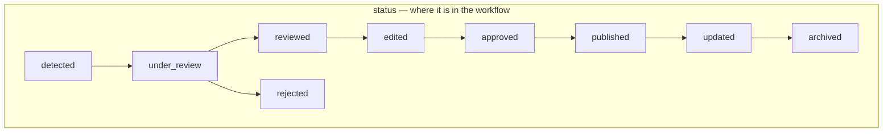
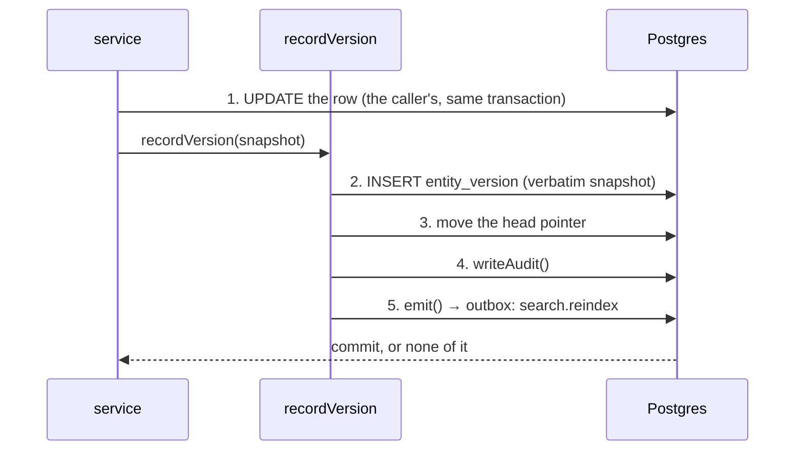

# Data model

Postgres, via Drizzle. **59 tables, 1 view, 26 SQL functions, 24 triggers,
48 numbered migrations.**

Schema definitions live in `server/db/schema/` and are the source drizzle-kit
generates from. Rules that Drizzle cannot express live in hand-written SQL in
`server/db/migrations/` — and a large share of this system's business logic is
there rather than in TypeScript.

---

## The rule that shapes everything else

**Business rules live in SQL triggers as often as in TypeScript.** Status
transitions, append-only tables, derived columns and the publish gate are all
enforced in the database. Changing a rule usually means a new numbered
migration, not just a service edit.

The reason is blunt: a service is one caller. A trigger is every caller,
including a console session, a migration script, and the next service somebody
writes without reading this file.

---

## Migrations

Checked in, applied in **filename order** — by the test harness against
PGlite, and by `db:migrate` against Neon. Same files, same order, both places,
so a trigger cannot be present in one and missing in the other.

Through `0017` the files alternate: even-numbered ones are usually
drizzle-generated structure, odd-numbered ones the hand-written rules for the
phase before them. That pairing stops there — from `0018` on, most migrations
are hand-written and a few are journaled no-ops whose only job is to re-anchor
drizzle-kit's snapshot (see `0021`).

| File | What it adds |
| --- | --- |
| `0000_core` | Identity, audit, versioning, outbox, taxonomy |
| `0001_append_only_and_privilege` | The rules Drizzle cannot express |
| `0002_information_model` | `information_item` and its relations |
| `0003_item_rules` | Status legality, the append-only transition trail |
| `0004_sources_and_evidence` | `source`, `source_family`, `source_fetch`, `evidence` |
| `0005_sources_and_evidence_rules` | Append-only for the two logs |
| `0006_evidence_and_assessments` | `item_evidence`, `item_assessment`, `review_queue` |
| `0007_evidence_and_assessment_rules` | Assessment immutability, derived columns, the publish gate, the `published_item` view |
| `0008_search_documents` | `search_document`, trigram index |
| `0009_search_hybrid` | `search_hybrid()` — retrieval fused in one function |
| `0010_ai_runs_and_suggestions` | `ai_run`, `ai_suggestion`, `prompt_registry` |
| `0011_ai_append_only` | The AI record cannot be rewritten after the fact |
| `0012_chat` | `chat_thread`, `chat_message`, `chat_citation`, `chat_tool_run` |
| `0013_chat_citation_rules` | A citation must name something retrieval returned |
| `0014_surfaces_and_reports` | `publication`, `report` and their relations |
| `0015_rls_and_hardening` | Publication publish gate, report trail, roles and RLS |
| `0016_narratives_and_actors` | `narrative`, `actor`, `narrative_observation` |
| `0017_narrative_rules` | Observations are append-only; derived columns are read-only |
| `0018_vercel_runtime` | RLS on chat and search, the public chat policies, `bump_rate_limit()`, `ai_spend_since()`, prune functions, and the role grants that let `SET ROLE` succeed |
| `0019_public_ai_run_returning` | `app_public` may read back the `ai_run` row it just inserted, so `INSERT … RETURNING` works |
| `0020_ai_cost_precision` | `ai_run.cost_usd` → `numeric(16,9)`; an embedding call can cost less than a millionth of a dollar and was rounding to zero |
| `0021_resync_snapshot_baseline` | No schema change. Re-anchors the drizzle snapshot, which `0018`–`0020` left behind because drizzle only snapshots what it generates |
| `0022_prune_functions_revoke_public` | The prune functions stop being executable by `PUBLIC` |
| `0023_ai_run_service_returning` | The same `RETURNING` visibility for `app_service`, kept off the public ledger |
| `0024_geopolitical_brief_automation` | `publication_section`, `briefing_run`, `homepage_feature`, the publication↔evidence and ↔narrative joins, and the first automatic-publication provenance constraint |
| `0025_public_narrative_projection` | RLS on `narrative`, `actor` and their joins; `app_public` may read a narrative only through a published link |
| `0026_evidence_retrieval_contract` | Evidence-level retrieval state, canonical identity, content hash and source health — the columns `EVIDENCE_IS_USABLE` filters on |
| `0027_discovery_connectors` | `agent_search` and `gdelt` source kinds, and `source.logical_key` with a unique index |
| `0028_briefing_quality_traceability` | `publication_passage` and its evidence join, the briefing edition/claim/quality-check/quarantine tables, and RLS for all of them |
| `0029_publication_related` | `publication_related` |
| `0030_public_correction_projection` | `public_publication_corrections()` — the version history a reader is allowed to see |
| `0031_automatic_quality_gate` | `enforce_publication_publish_gate()` gains the automatic path: twelve literal check names, and it must count exactly twelve passes. **Superseded by `0049`** — the count no longer exists |
| `0032_evidence_discovery_audit` | `evidence_discovery` |
| `0033_story_clusters` | `briefing_story_cluster`, `briefing_story_evidence` |
| `0034_briefing_jobs` | `briefing_job`, `briefing_job_delivery`, `briefing_stage_artifact` — the queued stage runner and the closed evidence packet |
| `0035_briefing_runtime_control` | `briefing_control`, the single row that pauses automatic publication |
| `0036_publication_editorial_filters` | `editorial_topic`, `primary_actor`, `arena`, `featured_israel_story` |
| `0037_schema_snapshot_sync` | Journaled no-op; snapshot baseline for `0022`–`0036` |
| `0038_narrative_watch_details` | `publication.narrative_watch_details` jsonb, backfilled for existing rows, plus the CHECK tying it to the section |
| `0039_schema_snapshot_sync` | Journaled no-op |
| `0040_briefing_alerts` | `briefing_alert` |
| `0041_briefing_job_deferred_delivery` | `deferred` joins the legal `briefing_job_delivery` statuses |
| `0042_automatic-publication-idempotency` | `publication.briefing_candidate_key` and a partial unique index, so one candidate publishes once per run |
| `0043_backfill_source_health` | Backfill: real last-successful-fetch times for sources that predate the health columns |
| `0044_backfill_discovered_source_categories` | Backfill: editorial category for discovered publishers, never overwriting a classified one |
| `0045_retire_duplicate_agent_search_queries` | Retires duplicate Agent Search collectors rather than deleting them, so their audit rows survive |
| `0046_track_briefing_raw_capture_size` | `source_fetch.raw_byte_size` |
| `0047_schema_snapshot_sync` | Journaled no-op |

---

## Tables by area

**Identity and governance** — `app_user`, `capability_grant`, `audit_log`,
`entity_version`, `idempotency_key`, `translation`

**Taxonomy** — `topic`, `event`, `information_item_topic`

**The information item** — `information_item`, `item_status_transition`,
`status_transition`

**Sources and evidence** — `source_family`, `source`, `source_fetch`,
`evidence`, `evidence_discovery`, `evidence_provenance`, `item_evidence`

**Assessment and review** — `item_assessment`, `review_queue`

**Search** — `search_document`

**AI** — `ai_run`, `ai_suggestion`, `prompt_registry`

**Chat** — `chat_thread`, `chat_message`, `chat_citation`, `chat_tool_run`

**Publication surfaces** — `publication`, `publication_item`,
`publication_evidence`, `publication_narrative`, `publication_passage`,
`publication_passage_evidence`, `publication_related`, `homepage_feature`

**Editorial media** — `editorial_media`, `publication_media` (migration
`0057`). An asset and its rights on one table, which publication wears it on
the other. This exists because `content-packages/homepage/media.json` — still
the registry for every hand-curated static asset — needs a human to add a
mapping in the same commit as the content, and a publication that arrives at
07:00 from an external composer has no such commit. Three rules live in SQL
rather than in TypeScript, because each is one a future write path would
otherwise re-decide: a `cleared` asset records the date it was cleared; `src`
must be a local path or an object in this project's own public Blob store, so
a publisher's CDN can never become the site's image host; and a `generated`
image may not wear a documentary role. `app_public` sees only cleared rows —
a withdrawal stops the asset being *reachable*, not merely being rendered.

**Public reports** — `report`, `report_file`, `report_status_history`

**Narratives** — `narrative`, `narrative_item`, `narrative_observation`,
`actor`

**The briefing pipeline** — `briefing_edition`, `briefing_run`,
`briefing_run_ai`, `briefing_stage_artifact`, `briefing_job`,
`briefing_job_delivery`, `briefing_story_cluster`, `briefing_story_evidence`,
`briefing_claim`, `briefing_quality_check`, `briefing_quarantine`,
`briefing_alert`, `briefing_control`

Thirteen tables is a lot for one feature, and the reason is that an edition is
not one transaction. Each stage is a separate run that can straddle a deploy, so
the state between stages has to be durable rather than in memory:
`briefing_stage_artifact` holds what each stage handed the next — including the
closed evidence packet every later stage re-reads by id — and
`briefing_quality_check` holds the per-candidate verdicts. It is a record, not a
gate: nothing counts these rows in SQL since migration `0049` — see
[the publish gate](#the-publish-gate).

**The editorial-update pipeline** — `editorial_run`, `editorial_operation`
(migrations `0059`–`0061`). A durable, resumable alternative to the briefing
pipeline's publish stage: one run owns a set of create/update operations on
`publication`, each recording its own input hash, media artifact and result so
a retried run reuses whatever an earlier attempt already prepared or completed
instead of redoing it. A `daily` run is deduplicated per Jerusalem local date
(`editorial_daily_date_once`); an `operations` run is deduplicated by its
caller-supplied `runId` and request hash. `publication.editorial_run_id` /
`editorial_operation_key` are this pipeline's provenance columns, parallel to
`briefing_run_id` / `briefing_candidate_key` — `automatic_publication_has_machine_provenance`
(migration `0060`) accepts either pair, never neither. `publication.topic_tags`
(migration `0061`) is a plain `text[]` refining discovery within a section
without adding another destination.

**Infrastructure** — `outbox`, `rate_limit`

---

## The two axes

`information_item` carries `status` and `assessment`, and they are
**deliberately never collapsed into one**.



`assessment` is one of nine independent values: `false`, `misleading`,
`manipulated`, `out_of_context`, `unsupported`, `unverified`, `contested`,
`satire`, `verified`.

An item can be `published` with **any** assessment, and `under_review` with
any. A schema that fuses the two makes "we are still checking" unrepresentable.

`confidence_summary` is `high | medium | limited`. There is deliberately **no
numeric probability column anywhere in the schema** — for scenarios, likelihood
is a band (`remote`, `unlikely`, `even`, `likely`, `near_certain`), because a
fabricated `0.62` gets screenshotted and quoted and no amount of surrounding
caveat travels with the screenshot.

### Derived columns

`information_item.assessment`, `confidence_summary` and
`current_assessment_id` are **derived and application code may not write
them** — `reject_derived_column_write()` raises if it tries. They are
maintained by `sync_item_derived_columns()`, an `AFTER INSERT` trigger on
`item_assessment`.

On a platform that publishes verdicts, a stale cache is not a performance
question: an item reading `verified` while its live assessment says
`contested` is a false publication.

`narrative` has the same arrangement via `sync_narrative_derived_columns()`
and `reject_narrative_derived_write()`.

---

## Versioning



Five things have to happen together whenever a versioned entity changes, and
every one of them is silent when forgotten — a missing version is only noticed
when someone asks what an item used to say. So they live in one function, in
one transaction.

**Nothing else may `UPDATE` a versioned table.** That is checkable by grepping
for `db.update(` outside the module repositories.

The snapshot is stored verbatim: a diff computed later against a schema that
has moved on is a diff of the wrong thing, and storage is cheaper than that
ambiguity.

`setIdentity(tx, label)` sets `app.identity` transaction-locally, which the
status-transition trigger reads to attribute the trail. It needs a real
transaction — the Neon HTTP driver would make it a silent no-op, which is why
`server/db/client.ts` exports only the WebSocket driver.

Six tables carry a `current_version_id` and are written through
`recordVersion()`: `information_item`, `evidence`, `source`, `publication`,
`narrative` and `actor`. `source_family` is not.

A publication versions under its **kind** — `news_update`, `brief`,
`geopolitical_analysis` or `scenario` — because `entity_version.entity_type`
keys on `ENTITY_TYPES`, which has no `publication` member. So a query for a
publication's history has to know its kind, and a query for "every version of
everything published" is four `entity_type` values rather than one.

---

## Append-only tables

Enforced by `reject_mutation()` and its siblings, not by convention:

`audit_log`, `entity_version`, `item_status_transition`, `source_fetch`,
`evidence_provenance`, `ai_run`, `prompt_registry`, `chat_tool_run`,
`report_status_history`, `narrative_observation`.

`item_assessment` is immutable once written (`enforce_assessment_immutability()`);
a changed verdict is a new row that supersedes the old one. That supersession
pointer is deliberately **not** a foreign key.

---

## The publish gate

Two halves, deliberately not duplicated:

1. A single-row `CHECK` (`published_has_timestamp_and_approver`) refuses a null
   `approved_by` or a missing assessment.
2. `enforce_publish_gate()` sees what only a trigger can — *who* the approver
   actually is. The reviewer must be human, and must not be the author of the
   thing they are approving.

The trigger does not repeat the CHECK's condition. Triggers run before
constraint validation, so raising on the same null would win the race and give
callers this trigger's SQLSTATE for a condition the CHECK already names
precisely.

`enforce_publication_publish_gate()` is the equivalent for the publication
surfaces, and it guards two routes to `published`, not one.

The human route is the same shape as above: a `CHECK`
(`published_publication_has_timestamp_and_approver`) demands a `published_at`
and either an `approved_by` or an `auto_published_at`, and the trigger then
checks that an `approved_by` names a human other than the author.

The **automatic** route is what the briefing pipeline uses. A row with
`auto_published_at` set may not also carry `approved_by` — a publication is one
or the other, and a row claiming both is a provenance lie rather than extra
assurance. It must carry a `briefing_run_id`, a `quality_approved_at`, a
`machine_author` and a `briefing_candidate_key`
(`automatic_publication_has_quality_provenance`, migration `0042`, whose partial
unique index also makes one candidate publish at most once per run). And the
trigger counts:

```sql
SELECT count(*) FROM briefing_quality_check
WHERE briefing_run_id = NEW.briefing_run_id
  AND candidate_key = current_setting('app.quality_candidate', true)
  AND status = 'pass'
  AND check_name IN ( … twelve literal names … );
-- raises unless the count is exactly 12
```

> ⚠️ **The SQL above is history, not current behaviour.** Migration `0049`
> (2026-09-03, "remove briefing quality gate") replaced
> `enforce_publication_publish_gate()` with a body containing **no**
> `briefing_quality_check` query, **no** twelve-name list and **no**
> `quality_passes <> 12` raise. It enforces machine provenance instead —
> `briefing_run_id`, `briefing_candidate_key`, `machine_author` — and the
> `automatic_publication_has_quality_provenance` constraint was dropped in
> favour of `automatic_publication_has_machine_provenance`. The block above is
> kept because rows written before `0049` were gated by it; nothing enforces it
> today. Retired by owner instruction (`0049…sql:59`).

**What enforces quality now.** One path, in TypeScript only:
`evaluateCandidate()` in `server/modules/briefing/quality.ts`, called from
`server/modules/briefing/external-publish.ts:265` — the external composer
ingest. `publications/repo.ts` no longer counts anything either; `595ca9d`
deleted `qualityCandidatePassed()` and its import, so `grep -c
REQUIRED_QUALITY_CHECKS server/modules/publications/repo.ts` returns 0.

Count `REQUIRED_QUALITY_CHECKS` at the source when you need the number. This
section said "eighteen" in five places against an array of seventeen, and
`CLAUDE.md` said "now 18" — every one of them hand-maintained prose with nothing
keeping it true.

Two things follow that an editor must hold:

- **An exemption still belongs inside its own check's pass condition**, emitting
  a `pass` with a detail string saying why it does not apply — the pattern
  `daily_brief_official_context` uses. That rule survives `0049`; what does not
  survive is the reason once given for it. Skipping a check no longer raises in
  Production, because nothing counts. It simply publishes.
  `tests/automatic-publication-gate.test.ts` still fires the trigger on PGlite,
  and `tests/briefing-quality.test.ts` still asserts the arithmetic — but read
  both knowing they now pin a mechanism no production path depends on.
- ⚠️ **The internal pipeline has no deterministic gate at all.** `enrich →
  cluster → triage → draft → publish` is still wired in `vercel.json` and still
  reachable through `POST /api/v1/admin/briefing/run`; its `publish` stage never
  calls `evaluateCandidate`, and the trigger no longer refuses it. Whether it
  should is an open owner decision, not a gap to close in passing.

An automated identity may never hold `assessment.publish`, `approval.grant`,
`evidence.restricted.read` or `policy.manage` — held as a const in
`server/contracts/enums.ts` so that `reject_automated_privilege()` in SQL and
the TypeScript guard cannot drift.

---

## `publication_section` lost a value, then gained eleven more

`war_update` was removed from `ARTICLE_SECTIONS` on 2026-09-01 and, by owner
decision of 2026-09-05, removed completely: it was an unused model path, and
every row that carried it was machine-published by the pre-retirement
pipeline — no `created_by`, no `approved_by`, all `archived`.

The residual rows were deleted (the underlying evidence entities are shared
and survive), and migration `0053` rewrote the `publication_section` type and
column without the value, leaving the three-value set (`daily_brief`,
`israel_update`, `narrative_watch`) with no compatibility shelf.

Migration `0058` (2026-09-06, the Premium Editorial pass) then added eleven
more: `news`, `influence_investigation`, `antisemitism`, `innovation`,
`science_medicine`, `technology_ai`, `achievement`,
`international_cooperation`, `people`, `courage_service`, `history_context` —
each via `ALTER TYPE ... ADD VALUE`, so it is additive and irreversible the
same way the retirement above was not: a Postgres enum value cannot be
`DROP`ped, only left unused, which is why the earlier retirement needed a
full type rewrite instead. `lib/publication-routing.ts`'s `routePublication()`
is the single source of truth for which hub, homepage band and public label
each of the now-fourteen values gets; `SECTIONS_BY_HOMEPAGE_SECTION` is
exhaustive over the enum by construction, so a fifteenth value fails
`tests/editorial-taxonomy.test.ts` rather than silently defaulting to news.

---

## The `narrative_watch_details` jsonb

`publication.narrative_watch_details` is `jsonb`, added by migration `0038` with
one CHECK: `(section = 'narrative_watch') = (narrative_watch_details IS NOT
NULL)`. That is the whole of what SQL knows about it. The eleven keys inside are
`narrativeWatchDetailsSchema` in `server/contracts/publication.ts` — a shape the
application promises and the database does not check.

The trade is deliberate and it has a cost. The eleventh key, `evidenceBasis`
(`"sourced" | "analysis"`), was added with no migration at all — a column of a
fixed shape would have needed one. But `0038`'s own backfill wrote **ten** keys
into every pre-existing Narrative Watch row, so every one of them carries no
`evidenceBasis` key rather than a wrong value. Two rules follow, and both are
written next to the code:

- **Read it as `=== "analysis"`, never as `!== "analysis"`.** An absent value
  must fall to the strict side — the reading that requires citations, not the
  one that excuses their absence.
- **The read path normalises, because it casts rather than parses.**
  `evidenceBasisSchema` carries `.default("sourced")`, but `toPublicPublication`
  never runs zod over the stored jsonb, so that default never fired there and
  callers were handed `undefined` while their types promised a string. Every
  public surface that marks an unsourced record would have silently mislabelled
  it. `publicNarrativeWatchDetails()` is the one place the stored value becomes
  a public one, and it resolves anything that is not a literal `"analysis"` to
  `"sourced"`.

`evidenceBasis` is **derived, never chosen** — it is exactly
`evidenceIds.length === 0` on the drafted article. That matters because the
draft retry loop feeds every quality-check failure back into the next attempt,
so a model-set flag would be found and used: one token would relax seven
evidence checks, and the loop is a gradient pointed straight at whatever stops
the failures.

An analysis record must cite **nothing anywhere** — claim `evidenceLinks`,
passage `evidenceIds`, and both id arrays in this jsonb. A half-sourced record
is rejected outright, by the zod refine on `createPublicationSchema` and again
by `claim_evidence_matrix` and `paragraph_traceability`. Deliberately in both
places: the half-sourced shape is the laundering path — one cheap citation
buying the relaxed checks — so neither gate can drift into permitting it alone.

---

## Search

`search_document` is a projection, rebuilt by the `search.reindex` outbox
consumer. `isIndexable()` refuses a row to restricted and secret evidence
entirely, which is why `GET /api/v1/search` needs no authentication.

`search_hybrid()` has **two bodies and one signature** — chosen at migration
time by whether pgvector is present. Retrieval is fused by **rank** (Reciprocal
Rank Fusion), never by score: lexical and semantic scores are not on the same
scale and adding them is arithmetic on incomparable units.

`search_has_semantic_arm()` is what lets the API answer `semantic: false`
honestly instead of returning lexical results as though they were the whole
answer.

The embedding column is `vector(1536)`, matching `MODEL_PROFILES.embedding`.
**Changing that dimension is a full table rewrite** — a different embedding
model must be added as a second column, never swapped into this one.

---

## Row-level security

`0015_rls_and_hardening.sql` creates three `NOLOGIN` roles — `app_public`,
`app_staff`, `app_service` — enables RLS on `information_item`, `publication`,
`evidence`, `search_document`, `report`, `report_file`, `audit_log`,
`chat_thread`, `chat_message` and others, and writes the policies.

`app_public` reading `report` fails at the **grant** level, not the policy
level: it holds `INSERT` and no `SELECT` at all. That is stronger than an empty
result set, because there is no policy to get wrong.

The policies are in effect at runtime. This section said the opposite until
2026-08-27, and it was wrong: `server/http/handler.ts` wraps every request
`accessFor()` classifies in `withDatabaseRole(role, identity, invoke)`, which
takes a dedicated pooled connection, issues `SET ROLE` plus
`set_config('app.identity', …)`, and `RESET ROLE` / `RESET ALL` before releasing
it. Migration `0018` grants the owner membership in the three roles so `SET ROLE`
succeeds; `0019` and `0023` add the policies that let `INSERT … RETURNING` work
under `app_public` and `app_service`.

> **Gap.** `withDatabaseRole` itself has no test. `tests/rls.test.ts` proves the
> policies through `SET LOCAL ROLE` inside a transaction on PGlite, and refuses
> to continue unless `current_user` actually changed — so the suite proves the
> policies are correct, and proves nothing about the pooled, session-scoped
> mechanism production actually uses to reach them.
> See [architecture.md](architecture.md#known-architectural-gaps).

---

## The outbox

```sql
outbox(id, topic, payload, entity_type, entity_id, created_at,
       available_at, published_at, attempts, last_error)
```

Written inside the transaction that caused the work. `available_at` is what lets
a producer *schedule* work rather than only enqueue it, and it is also where the
drain writes its backoff after a failed dispatch; `published_at` is null until
the row reaches the queue. The one index, `outbox_pending`, is partial on
`published_at IS NULL`, so it stays the size of the backlog rather than the size
of history.

**Four topics today**, all in `TOPICS` in `server/core/outbox.ts`:

| Topic | Emitted by | Does |
| --- | --- | --- |
| `search.reindex` | `recordVersion()`, and the assessment service | Rebuilds one `search_document` row |
| `email.notification` | `reports` service | Sends the workspace a new-report mail |
| `publication.cache-invalidate` | `publications` service | Expires the public read caches |
| `briefing.alert` | `briefing/alerts.ts` | Delivers one operator alert |

A topic with no entry in `server/jobs/consumers/index.ts` is a bug — the queue
route throws loudly rather than silently acknowledging a message nothing
handled. The converse is not a bug: **there is one consumer with no producer,
and it is a tombstone.** `item.detected` lives in `RETIRED_TOPICS`, which
`emit()` does not accept, so re-emitting it is a type error. Its consumer stays
registered because undrained rows may exist in Production and
`dispatchOutboxMessage` throws on an unregistered topic. Delete the entry and
the consumer together, once

```sql
SELECT count(*) FROM outbox WHERE topic = 'item.detected' AND published_at IS NULL
```

reads 0 in Production and the queue holds nothing in flight.

`search.reindex` volume is what sizes the drain. A briefing edition materializes
roughly one claim per paragraph and emits a reindex for each — about 190 rows at
once. `drainOutbox`'s `DEFAULT_DRAIN_LIMIT` is 250 and the cron runs every 15
minutes; at the earlier limit of 25, one edition took eight ticks, so a story
published at 05:00 was not searchable until nearly 07:00.

---

## Rate limiting

Counted in Postgres by `bump_rate_limit(bucket, window_seconds)`, which
increments and returns the new count in a single statement, so two concurrent
requests cannot both read a stale value and both conclude they are under the
ceiling.

The bucket is always a hash. Storing raw IPs would turn this table into a
visitor log, which is a thing to protect rather than a thing to keep.
`prune_rate_limits()` exists for cleanup.

---

## Testing against the real thing

`tests/` runs on vitest in a node environment against
`server/db/testing.ts` `freshDatabase()` — **PGlite, a real Postgres 18
compiled to WASM**, migrated per test, so triggers, constraints, generated
columns and roles behave as they will in Neon. Every test gets its own
database, so there is no teardown beyond garbage collection.

Two things PGlite does not have, both confirmed by spike rather than assumed:

1. **pgvector.** Semantic-search tests skip unless `TEST_DATABASE_URL` points
   at a Postgres that has it. Lexical search — `tsvector`, `pg_trgm` — is
   fully covered locally.
2. **Concurrency.** One connection. Fine, because every test gets its own
   database.

The suite never needs a `DATABASE_URL`.
