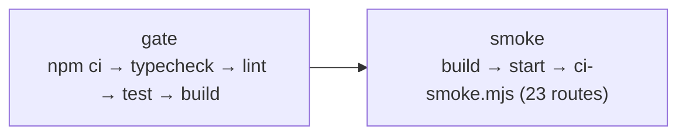

# Development and operations

Install, run, verify, ship. And the parts of shipping that are not wired up
yet, said plainly.

---

## Getting started

```bash
npm ci
npm run dev
```

Open <http://localhost:3000>. **No configuration is required** — the frontend
and static routes need no environment variables, and the test suite runs
against an in-process database. Database-backed pages and API routes need a
real Preview `DATABASE_URL`. Fresh clones, worktrees, and remote workspaces do
not inherit `.env.local`; follow the
[remote-workspace recovery procedure](environment.md#remote-workspaces-and-fresh-checkouts)
before starting the server.

Requires Node 24 (what CI and Vercel use). The API routes will fail without a
`DATABASE_URL`; see [`environment.md`](environment.md).

---

## Everyday commands

```bash
npm run dev          # next dev
npm run sync:start   # update main, delete merged branches, flag open branches
npm run typecheck    # tsc --noEmit
npm run lint         # eslint — this is where the architecture boundaries are enforced
npm test             # vitest run
npm run build        # next build
npm run verify:changed  # adaptive gate for the current working-tree diff
npm run verify:full     # complete local and CI handoff gate
npm run audit:ui        # browser geometry, landmarks, focus and no-JS audit
npm run audit:interaction # browser route and console-error smoke audit
npm run main:update     # merge a completed serious round into main and push it
npm start            # next start, after a build
```

Narrower test runs:

```bash
npx vitest run tests/items.test.ts
npx vitest run -t "publishes"
npm run test:watch
```

The full gate — `typecheck`, `lint`, `test`, and `build` — is what CI runs on
every push and pull request to `main`.

`verify:changed` reads tracked and untracked working-tree changes and runs the
automated checks selected by the diff.

Both browser audits expect a server at `http://localhost:3000`; pass another
origin after `--` when auditing a reviewed deployment, for example
`npm run audit:ui -- https://example.vercel.app`. `audit:ui` uses its built-in
responsive matrix. `audit:interaction` checks representative routes and
reports non-200 responses or browser console errors.

`sync:start` is an optional convenience command. It fetches `origin`, updates
`main` when the tree permits it, deletes branches already merged into main, and
reports any open branches without blocking work.

`main:update` updates local main, merges the current branch, pushes main, and
removes the completed branch locally and remotely when safe. Run verification
when it is useful to the owner; it is not a publication gate.

---

## Retired composer

`npm run briefing:compose` refuses live collection, model drafting and submission.
`npm run briefing:compose -- --fixture` only validates and prints a historical
package. This does not disable evidence collection under the ingest cron.
New editorial work uses the ChatGPT whole-site delivery path. The legacy
external-publish API and `/api/internal/codex/briefing-import` are authenticated tombstones: valid credentials receive
412 PRECONDITION_FAILED and no package is parsed or published. Historical
publication URLs remain unchanged.

## Database commands

```bash
npm run db:generate   # schema → a new numbered migration. Needs no database.
npm run db:migrate    # apply migrations. Needs a real DATABASE_URL.
npm run db:studio     # drizzle-kit studio. Needs a real DATABASE_URL.
npm run schema:check -- preview    # read-only compatibility check of the labelled database
npm run schema:check -- production # required before production promotion or rollback
```

`db:generate` deliberately needs nothing provisioned — which is what kept the
whole schema buildable before any service existed.

Hand-written SQL rules go in a **new numbered file** in
`server/db/migrations/`, alongside the generated ones. They are applied in
filename order by both `db:migrate` and the test harness, so a trigger cannot
exist in one place and not the other. See
[`data-model.md`](data-model.md#migrations).

---


## CI

`.github/workflows/ci.yml`, on push and pull request to `main`. Two jobs:



`smoke` installs Playwright's Chromium with `--with-deps`, starts the built
app, waits up to 60s for it to answer, then runs the route smoke test.

**CI does not deploy.** There is no deployment step in the workflow.

---

## Deployment

**Git auto-deploy is connected, and a push to `main` reaches Production on its
own.** This section said the opposite until 2026-09-04, and the correction was
paid for twice in one session: two pushes were live on `lionsofzion.io` within
two minutes each, with no manual step.

The mechanism is the GitHub integration on the Vercel project, whose
`link.productionBranch` is `main`. `vercel.json` disables git deployment for
the `chatgpt-editorial-updates` delivery branch and for nothing else, and the project has
no deploy hooks. Each branch also carries its own `vercel.json` with
`"deploymentEnabled": false`, which is the copy that actually suppresses the
build, because Vercel reads the config from the commit being pushed. Confirm
with
`vercel api "/v9/projects/<projectId>?teamId=<team>"`.

What follows from it: **a migration must be applied before the code that needs
it is pushed.** Migration `0051` added an `entity_type` value the operations
console writes on every tool call, and the code reached Production ahead of the
schema — the first tool call would have failed its audit write. The order is
apply against Preview, verify, then back up and migrate Production, verify,
then push the application branch for review. Use
`npm run briefing:migrate:preflight -- preview` and then
`npm run briefing:migrate:preflight -- production`, with the corresponding
`DATABASE_URL` and `DATABASE_RESOURCE_ENV`. Production also requires
`BRIEFING_MIGRATION_SNAPSHOT` pointing to the pre-migration backup manifest.
Never use the local Preview connection as a substitute for Production.

`npm run build` runs the read-only schema preflight before Next.js when
`VERCEL_ENV=production`. It requires an explicitly matching database label,
an exact hash-and-timestamp receipt for the newest checked-in migration, and
every application table column in the target database. The newest receipt is
the deployment compatibility marker: adding migration N advances it, so code
that needs N cannot pass against a database that ends at N-1. Historical
receipt hashes are not revalidated because several old migrations were amended
after application; live schema columns remain verified independently. Missing
credentials, an unreachable DB, a missing or changed current marker, or a
missing column stop the build. This does not apply migrations or change
production content. Ordinary local and CI builds remain database-free.

Promotion of an already-built Preview and rollback do not run a fresh build:
run `schema:check -- production` from the exact candidate commit before either.
The build check alone cannot protect a dashboard promotion that bypasses it.
Use additive migrations while old and new deployments can coexist; rollback
restores application code, not data or schema. A migration ledger and column
check do not prove that manually altered triggers or policies are intact.

`vercel.json` declares one Queue trigger for the transactional outbox plus four
technical production schedules. Editorial package execution is emitted through
that outbox after an authenticated receiver accepts explicit operations; Vercel
does not start editorial research, drafting, or a daily edition. The outbox
dispatcher takes the `outbox-dispatch` topic and its `maxDuration` is declared
in the route file.

```json
{
  "crons": [
    { "path": "/api/internal/cron/ingest", "schedule": "0,30 * * * *" },
    { "path": "/api/internal/cron/embed", "schedule": "10,40 * * * *" },
    { "path": "/api/internal/cron/outbox-drain", "schedule": "*/15 * * * *" },
    { "path": "/api/internal/cron/maintenance", "schedule": "20 3 * * *" }
  ]
}
```

For rolling back a bad production deploy, see
[`../.ai/ROLLBACK.md`](../.ai/ROLLBACK.md).

### Scheduled work

Production schedules are authenticated by `CRON_SECRET`. Ingest
runs at minutes 0 and 30, embeddings at 10 and 40, the outbox drain every 15
minutes, and maintenance daily at 03:20 UTC. Every handler is idempotent and
safe to retry. **No Vercel route starts editorial work.** A
`whole-site-update-v1` package is fulfilled only when it arrives at
`POST /api/internal/editorial-updates/ingest`, idempotent on
`editorial_run.run_key` plus its canonical request hash. The legacy
`/api/internal/briefing/external-publish` endpoint is an authenticated 412
tombstone: it does not parse or publish a package.

The drain hands up to 250 rows a tick to the queue, which is 1,000 an hour and
comfortably more than one edition's load — a brief materializes roughly one
claim per paragraph and emits a `search.reindex` for each, around 190 rows
arriving together. A backlog that survives several ticks is therefore a
dispatch failure, not a throughput limit; check the queue binding before
raising the number.

### Deploying across a delivery run

> **Corrected 2026-09-06.** This section said `qualityCandidatePassed`
> "requires a candidate's recorded quality checks to number exactly
> `REQUIRED_QUALITY_CHECKS.length`". That function no longer exists — commit
> `595ca9d` deleted it along with its import, and
> `grep -c qualityCandidatePassed server/modules/publications/repo.ts`
> returns `0`. Migration `0049` had already removed the equivalent count from
> `enforce_publication_publish_gate()`. Nothing counts quality checks on any
> publish path.

What is actually at risk when a deploy lands mid-run:

- **A whole-site editorial run is durable and survives a deploy.** Its state
  lives in `editorial_run` / `editorial_operation`, its work is one transaction
  per operation, and a worker holds a five-minute lease with a fencing token.
  A deploy that kills the worker mid-run leaves the lease to expire; the next
  `editorial.run-process` delivery reclaims it and skips every operation
  already `completed`. If the run ended `failed` or `partial`, resume it (see
  below).
- **A contract change must not straddle a run.** The package a GitHub Action
  is currently posting was validated by the tooling on `main` *at checkout
  time*, and the receiver parses it with the tooling that is *deployed*. A
  deploy that tightens `whole-site-update-v1` between those two moments
  rejects a package that validated seconds earlier. Land contract changes when
  no delivery is in flight — the Actions tab on the `chatgpt-editorial-updates` branch
  is the check — and remember a rollback strands a run exactly as the deploy
  did.
- **A schema change still goes first.** `npm run db:migrate` against Preview,
  then Production, then push. `vercel rollback` is the fast undo.

Nothing is lost when a run is caught mid-flight: completed operations are
published, the rest are resumable, and any article can still be published by
hand from the administrator's publication manager.

### Whole-site editorial updates

The full mechanism is [`whole-site-updates.md`](whole-site-updates.md); this is
the runbook.

**1. Dry-run the package.** From a `main` checkout, with no secret and no
network call:

```bash
npm run editorial:publish -- path/to/2026-09-06-0001.json --dry-run
```

It prints `runId`, `composer`, and the create/update/homepage/recommendation
counts, or one line per Zod issue and exit code `1`. A package that does not
pass this must not be committed.

**2. Commit it to the delivery branch.** The file goes to
`editorial-updates/<Israel-local-date>-<runId>.json` on the orphan
`chatgpt-editorial-updates` branch. Never onto `main`: `main` deploys.

**3. Watch the Action.** The push triggers *Deliver editorial update* on that
branch. Its concurrency group is `editorial-update-delivery` with
`cancel-in-progress: false`, so a second push queues behind the first. The job
checks out `main` for tooling, validates each changed package with
`--dry-run`, then delivers it. Read the two log groups per package —
`Validate <file>` and `Deliver <file>`. The deliver step prints
`accepted runId=…`, then polls for up to 20 minutes and finally prints:

```
runId=… status=completed created=3 updated=1 failed=0
url=/articles/…
```

It exits non-zero when the run failed, any operation failed, or the homepage
stage errored — so a red Action means something did not publish, not that the
network was slow.

```bash
# The same status the Action polls, by hand:
curl -s -H "x-editorial-update-secret: $EDITORIAL_UPDATE_INGEST_SECRET" \
  "https://lionsofzion.io/api/internal/editorial-updates/runs/<runId>" | jq
```

**4. Verify the three hubs.** Every published record is reachable at
`/articles/<publicId>` — the URLs the run printed — and files into exactly one
hub by its `section`:

| Hub | Check |
| --- | --- |
| News & Analysis | <https://lionsofzion.io/geopolitical-brief> |
| Fake Resistance | <https://lionsofzion.io/fake-resistance> |
| The People of Israel | <https://lionsofzion.io/people-of-israel> |

Then the homepage itself, for the placements the run reported under
`report.homepage.changes`. `/october-7` is a curated archive and is never
touched by a run. A record that appears on the wrong hub is a `section`
mistake in the package, not a routing bug: `routePublication()` in
`lib/publication-routing.ts` is the only mapping.

The signed-in admin views are `GET /api/v1/admin/editorial-update` (recent
runs) and `GET /api/v1/admin/editorial-update/{id}` (one run in full).

**5. On a partial run.** `partial` means some operations published and some did
not; `report.errors` names each one with its stage and message, and
`report.publications.failed` counts them. Fix the cause first — a `media` stage
error is usually an unreachable image or one whose rights are not cleared for
the `article` surface, and a `publication` stage error is usually an update
whose target is not live. Then, signed in as the admin, resume with the run's
**internal id** (the `id` the ingest returned, not the package `runId`):

```http
POST /api/v1/admin/editorial-update/{id}
{"action":"resume"}
```

Resume requeues only `failed` and `running` operations, reuses media artifacts
already prepared, and never republishes a completed one. Only a `failed` or
`partial` run may be resumed; anything else answers `409`.

If the fix requires changing the package itself, correct the file and commit it
under a **new `runId`**. Re-posting a changed body under the old `runId` is
refused with `409` — one run identifier never means two things.

A terminal run (either direction) emails its report to
`EDITORIAL_REPORT_EMAIL`, falling back to `ADMIN_EMAIL`.

### Source catalog changes

`server/modules/sources/catalog.ts` is reconciled into the database by the
administrator dashboard's catalog-sync action
(`POST /api/v1/admin/briefing/sources/sync`). For `agent_search` entries that
sync **only ever creates**: it skips a slug that already exists and skips a
query whose derived logical key already exists, and there is no update path.
Editing a query in place therefore leaves the live source running the old text
while the file claims the new one. The rule is **change the query, change the
slug**.

Everything the sync creates is `active: false`, so nothing starts scanning by
itself. Rolling out a rewritten query is two manual steps:

1. Activate the new `agent-search-*` source. The dashboard's per-row verify
   action runs `POST /api/v1/sources/{id}/fetch`, which is a real fetch against
   the live connector, and flips `active` to true only when it succeeds and
   sees at least one item.
2. Deactivate the source it supersedes, with `PATCH /api/v1/sources/{id}` and
   `{"active": false}`. There is no button for this. Skipping it leaves both
   queries running and doubles their share of the Agent Search budget.

The `group` field on a catalog entry is written into the created source's
`config` and read by nothing: it labels which article a query was collected
for, which is useful in the admin audit. Retagging one changes documentation,
not behaviour. Only the `query` string has an effect.

### Provisioned dependency order

The deployed order is retained for recovery and new environments:

1. **Neon Postgres** → set the environment-specific `DATABASE_URL`; run
   `npm run db:migrate` against Preview first, then Production.
2. **Neon Auth** → set `NEON_AUTH_BASE_URL`, `NEON_AUTH_COOKIE_SECRET` and the
   single `ADMIN_EMAIL`; create the admin account through `/admin/login`.
3. **Vercel Blob** → set the RSS token and archive-prefixed variables; never
   reuse the archive store for ingestion.
4. **Vercel Queues** → link the project so the OIDC topic is available.
5. **AI Gateway** → use Vercel OIDC; verify model profiles and keep the
   application/Gateway spend caps enabled.
6. **Google Agent Search** → use Workload Identity Federation and service
   account impersonation; never add a static key or JSON credential.

Before changing a deployed dependency, read
[`vercel-infrastructure.md`](vercel-infrastructure.md) and the
[known gaps](architecture.md#known-architectural-gaps).

---

## Branch protection on `main`, and what a repository file cannot do

Read from the API on 2026-09-07: one ruleset, `protect-main-history`
(id `22347272`), active on `~DEFAULT_BRANCH`, with rules `deletion` and
`non_fast_forward` and no bypass actors. **Force-pushing `main` and deleting it
are already blocked.** There is no required-pull-request rule and no required
status check, so an ordinary direct push to `main` succeeds.

### The finding that decides how much this can be hardened

The scheduled ChatGPT editor commits to the delivery branch **as
`lions-admin` — the owner's own GitHub account.** No branch rule can
distinguish the automation's push from the owner's, because to GitHub they are
the same identity. Renaming the delivery branch to
`chatgpt-editorial-updates` raises the bar, since the automation no longer
holds a path to a branch it used to write to under an older name, but it does
not create a boundary.

**A file in this repository cannot enforce an account-level rule.** What
follows is the change that would, written out so it can be applied deliberately
rather than assumed to be in force.

### The ruleset to add, once the automation has its own identity

First give the automation an identity of its own — a GitHub App installation or
a machine user with write access — and issue its credential to the Scheduled
Task. Then add a second ruleset on `main`:

```jsonc
{
  "name": "require-review-on-main",
  "target": "branch",
  "enforcement": "active",
  "conditions": { "ref_name": { "include": ["~DEFAULT_BRANCH"], "exclude": [] } },
  "rules": [
    { "type": "pull_request",
      "parameters": { "required_approving_review_count": 0,
                      "dismiss_stale_reviews_on_push": false,
                      "require_code_owner_review": false,
                      "require_last_push_approval": false,
                      "required_review_thread_resolution": false } },
    { "type": "required_status_checks",
      "parameters": { "strict_required_status_checks_policy": true,
                      "required_status_checks": [
                        { "context": "typecheck, lint, test, build" },
                        { "context": "archive assets reachable (CDN)" },
                        { "context": "route smoke test (headless Chromium)" }
                      ] } }
  ],
  "bypass_actors": [
    { "actor_type": "RepositoryRole", "actor_id": 5, "bypass_mode": "always" }
  ]
}
```

Apply with `gh api --method POST repos/lions-admin/lions-of-zion/rulesets --input <file>`.

The three check names are the job `name:` values in `.github/workflows/ci.yml`
and must match exactly. The `admin` bypass keeps ordinary maintenance working;
it is also why adding this ruleset **before** the automation has a separate
identity would restrict only the owner and nothing else, which is why it has
not been applied.

`chatgpt-editorial-updates` is deliberately left out of both rulesets: a
package must land there with no review, and `vercel.json` already excludes the
branch from deployment so a package push never builds the site.

## Troubleshooting

### Both scenes are black
Almost always the verification trap, not a bug. Check you are in real Chrome
with a real GPU, not headless Chromium, an in-app pane, or a container. Try
`/?forceWebGL=1` to rule out WebGPU specifically.

### `npm run lint` reports thousands of errors in files nobody wrote
ESLint has walked into `.claude/worktrees/`, which contains full checkouts with
their own `node_modules`. That path is in `globalIgnores`; if you see this, the
ignore was removed.

### A route returns 500 `INTERNAL_ERROR` with nothing useful
By design — the detail is in the log, not the body. Find the request by the
`requestId` in the error body; it is the same id in the log line and the audit
row. The log is one JSON line with `url`, `method`, `durationMs`, `message` and
`stack`.

### A route returns 401 `UNAUTHENTICATED` in production
**Stale — deleted 2026-08-27.** This said `requireActor` refuses in production
by design until Phase 8. Neon Auth replaced that gate; `requireActor` now
throws only when no actor was authenticated. See
[`api.md`](api.md#authentication).

### "Ask the Lion" says the desk is offline
The client probes with `GET /api/v1/chat/threads`. Unprovisioned, that answers
500 and the modal opens in its offline state — which is the correct behaviour
today, not a bug.

### Search returns results but `semantic: false`
This deployment has no pgvector, so those are lexical results only. Honest by
design rather than hidden.

### `embed` cron reports `skipped`
**Stale — the AI Gateway is wired.** This said there is no embedder. The route
reports the backlog size
rather than failing — a scheduled job that alarms on a deliberate, known state
is one people learn to ignore.

### Outbox rows are piling up
**Stale — it is scheduled.** `vercel.json` runs the drain at `*/15 * * * *` and
the handler exists. A row that
fails to dispatch backs off 30s → 2m → 10m → 30m → 1h and is retried, never
abandoned. The per-tick limit is 250, well above an edition's load, so a
growing backlog means `dispatch` is failing rather than that the drain is
behind; the row's `last_error` and `attempts` columns say which.

### Semantic-search tests are skipping
Expected without `TEST_DATABASE_URL`. PGlite has no pgvector, and no package
publishes it separately.

### מדידת לחץ חיבורים

בסביבת בדיקה מבודדת בלבד מריצים `TEST_DATABASE_URL=... pnpm briefing:db-pressure`.
הבדיקה מבצעת שאילתות `select 1` בלבד, מדווחת זמני `p50` ו־`p95`, ואינה משתמשת
בכתובת מסד הנתונים של ייצור או בערכים מצונזרים. אפשר לשנות את העומס באמצעות
`BRIEFING_DB_PRESSURE_CONCURRENCY` ו־`BRIEFING_DB_PRESSURE_ROUNDS`.

בדיקת קישוריות הזנות יכולה לרוץ במקביל ברמת עומס מוגבלת באמצעות
`pnpm briefing:sources:connectivity`; ברירת המחדל היא ארבע בקשות במקביל.
להפעלת שער מחמיר שמחזיר כישלון אם הזנה כלשהי אינה תקינה משתמשים ב־`--strict`.
