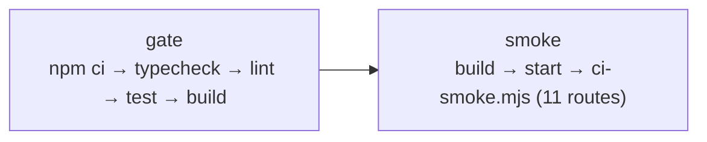

# Development and operations

Install, run, verify, ship. And the parts of shipping that are not wired up
yet, said plainly.

---

## Getting started

```bash
npm ci
npm run dev
```

Open <http://localhost:3000>. **No configuration is required** — the frontend
needs no environment variables, and the test suite runs against an in-process
database.

Requires Node 22 (what CI uses). The API routes will fail without a
`DATABASE_URL`; see [`environment.md`](environment.md).

---

## Everyday commands

```bash
npm run dev          # next dev
npm run typecheck    # tsc --noEmit
npm run lint         # eslint — this is where the architecture boundaries are enforced
npm test             # vitest run
npm run build        # next build
npm start            # next start, after a build
```

Narrower test runs:

```bash
npx vitest run tests/items.test.ts
npx vitest run -t "publishes"
npm run test:watch
```

The full gate — `typecheck`, `lint`, `test`, `build` — is what CI runs on
every push and pull request to `main`, and is worth running before asking for
review.

---

## Database commands

```bash
npm run db:generate   # schema → a new numbered migration. Needs no database.
npm run db:migrate    # apply migrations. Needs a real DATABASE_URL.
npm run db:studio     # drizzle-kit studio. Needs a real DATABASE_URL.
```

`db:generate` deliberately needs nothing provisioned — which is what kept the
whole schema buildable before any service existed.

Hand-written SQL rules go in a **new numbered file** in
`server/db/migrations/`, alongside the generated ones. They are applied in
filename order by both `db:migrate` and the test harness, so a trigger cannot
exist in one place and not the other. See
[`data-model.md`](data-model.md#migrations).

---

## Visual verification

### The trap

The in-app browser can report `visibilityState === "hidden"` and suspend
`requestAnimationFrame`, making both scenes appear black. Headless Chromium
falls back to SwiftShader, which the GPU probe correctly rejects, so the scene
never mounts there either.

**Visual checks must use real Chrome** via `playwright-core` with
`headless: false`. The three real-Chrome scripts hardcode
`/Applications/Google Chrome.app/Contents/MacOS/Google Chrome`, so they run on
the macOS workstation only — never in a Linux container or on CI.

Any edit to intro timing, copy, or composition must be captured in real Chrome.

### The scripts

Start the dev server first, then:

| Command | Runs where | Checks |
| --- | --- | --- |
| `npm run verify:graphics -- http://localhost:3000 /tmp/lions-matrix` | macOS only | Orbit composition at 7 viewports, 320→2560 |
| `node scripts/final-verify.mjs http://localhost:3000 /tmp/lions-final` | macOS only | Intro handoff, keyboard, WebGPU, forced WebGL2, no-JS fallback, overlays, console errors |
| `node scripts/verify-home-band.mjs http://localhost:3000 /tmp/lions-home-band` | macOS only | The scene keeps its exact box; the band scrolls, is opaque, carries all eight links; the intro scroll lock holds |
| `node .claude/skills/verify-intro/capture.mjs` | macOS only | Intro frames, for review |
| `node scripts/ci-smoke.mjs http://localhost:3000` | anywhere | 11 routes return 200 with no console errors |

`ci-smoke.mjs` is the only one that uses Playwright's own bundled Chromium, and
the only one CI can run. It is deliberately modest — route availability and
console errors only, no assertion about the particle scene, because real WebGPU
support in headless CI Chromium is unreliable.

`/?forceWebGL=1` runs the complete experience on WebGL2.
`/particle-demo?forceWebGL=1` is the isolated tuning harness.

---

## Rebuilding particle assets

```bash
npm run bake:nav-lion    # → public/particles/lion-v2-{45k,90k,180k}.bin
npm run bake:nav-icons   # → public/icons/*.sdf.png
npm run poster:nav       # → public/posters/particle-nav.{webp,avif}
```

Source artwork lives in `assets/`. The output is committed to git like any
other file — rolling back a bad bake is a `git revert`, not a Vercel
promotion.

---

## CI

`.github/workflows/ci.yml`, on push and pull request to `main`. Two jobs:



`smoke` installs Playwright's Chromium with `--with-deps`, starts the built
app, waits up to 60s for it to answer, then runs the route smoke test.

**CI does not deploy.** There is no deployment step in the workflow.

---

## Deployment

Git auto-deploy is **not connected**. Production deployment is a separate,
manual Vercel operation, so a merge to `main` does not reach production on its
own.

`vercel.json` today declares exactly one thing:

```json
{
  "functions": {
    "app/api/internal/queue/outbox-dispatch/route.ts": {
      "experimentalTriggers": [{ "type": "queue/v2beta", "topic": "outbox.dispatch" }]
    }
  }
}
```

For rolling back a bad production deploy, see
[`../.ai/ROLLBACK.md`](../.ai/ROLLBACK.md).

### Scheduled work

> **Nothing is scheduled.** `vercel.json` has no `crons` array, so
> `/api/internal/cron/ingest`, `/api/internal/cron/embed` and
> `/api/internal/cron/outbox-drain` will never fire on their own — despite
> `cron/ingest/route.ts`'s own comment saying `vercel.json` carries the
> schedule.

Provisioning them is a `vercel.json` change plus `CRON_SECRET` in the Vercel
project. Vercel signs every cron invocation with that secret automatically once
the variable exists; there is nothing else to wire up. Cadences are a product
decision, not a code one — `embed` and `outbox-drain` are both safe to run at
any cadence and safe to run concurrently with themselves.

This is deliberately **not** applied here; it is an infrastructure change that
starts spending money against services that are not provisioned.

### Provisioning order

Nothing below is provisioned. If it is ever done, the dependency order is:

1. **Neon Postgres** → `DATABASE_URL` (pooled). Run `npm run db:migrate`.
   Everything under `server/` needs this and nothing else works without it.
2. **Vercel Blob** → `BLOB_READ_WRITE_TOKEN`. Ingestion stores raw fetched
   bytes here.
3. **Cron schedules** → `CRON_SECRET` plus a `crons` array. Ingestion begins.
4. **Vercel Queues** → `vercel link && vercel env pull` (OIDC, no env var).
   Optional: without it the drain simply retries.
5. **AI Gateway** → `AI_GATEWAY_API_KEY`. Verify `MODEL_PROFILES` slugs against
   `GET /api/internal/ai/models` first. Chat and embeddings begin.

Before step 1, read
[the gaps](architecture.md#known-architectural-gaps) — two of them
(RLS not engaged, unauthenticated evidence reads) become live the moment a
database exists.

---

## Troubleshooting

### Both scenes are black
Almost always the verification trap, not a bug. Check you are in real Chrome
with a real GPU, not headless Chromium, an in-app pane, or a container. Try
`/?forceWebGL=1` to rule out WebGPU specifically.

### `npm run lint` reports thousands of errors in files nobody wrote
ESLint has walked into `.claude/worktrees/`, which contains full checkouts with
their own `node_modules`. That path is in `globalIgnores`; if you see this, the
ignore was removed.

### A route returns 500 `INTERNAL_ERROR` with nothing useful
By design — the detail is in the log, not the body. Find the request by the
`requestId` in the error body; it is the same id in the log line and the audit
row. The log is one JSON line with `url`, `method`, `durationMs`, `message` and
`stack`.

### A route returns 401 `UNAUTHENTICATED` in production
Expected. `requireActor` refuses in production by design until Phase 8. See
[`api.md`](api.md#authentication).

### "Ask the Lion" says the desk is offline
The client probes with `GET /api/v1/chat/threads`. Unprovisioned, that answers
500 and the modal opens in its offline state — which is the correct behaviour
today, not a bug.

### Search returns results but `semantic: false`
This deployment has no pgvector, so those are lexical results only. Honest by
design rather than hidden.

### `embed` cron reports `skipped`
There is no embedder until the AI Gateway is wired. It reports the backlog size
rather than failing — a scheduled job that alarms on a deliberate, known state
is one people learn to ignore.

### Outbox rows are piling up
Check whether the drain cron is scheduled at all (it is not, today). A row that
fails to dispatch backs off 30s → 2m → 10m → 30m → 1h and is retried, never
abandoned.

### Semantic-search tests are skipping
Expected without `TEST_DATABASE_URL`. PGlite has no pgvector, and no package
publishes it separately.

### A story-timeline edit was rejected by a hook
`.claude/hooks/check-story-timeline.mjs` runs on every `Edit`/`Write` and
re-checks the intro invariants — 12 beats, the `battlefield-for-truth` id,
desktop and mobile line arrays rejoining to the canonical text — then runs
`tsc --noEmit`. See `CLAUDE.md`.
