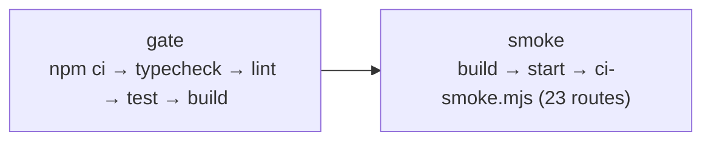

# Development and operations

Install, run, verify, ship. And the parts of shipping that are not wired up
yet, said plainly.

---

## Getting started

```bash
npm ci
npm run dev
```

Open <http://localhost:3000>. **No configuration is required** — the frontend
and static routes need no environment variables, and the test suite runs
against an in-process database. Database-backed pages and API routes need a
real Preview `DATABASE_URL`. Fresh clones, worktrees, and remote workspaces do
not inherit `.env.local`; follow the
[remote-workspace recovery procedure](environment.md#remote-workspaces-and-fresh-checkouts)
before starting the server.

Requires Node 24 (what CI and Vercel use). The API routes will fail without a
`DATABASE_URL`; see [`environment.md`](environment.md).

---

## Everyday commands

```bash
npm run dev          # next dev
npm run sync:start   # update main, delete merged branches, flag open branches
npm run typecheck    # tsc --noEmit
npm run lint         # eslint — this is where the architecture boundaries are enforced
npm test             # vitest run
npm run build        # next build
npm run verify:changed  # adaptive gate for the current working-tree diff
npm run verify:full     # complete local and CI handoff gate
npm run main:update     # merge a completed serious round into main and push it
npm start            # next start, after a build
```

Narrower test runs:

```bash
npx vitest run tests/items.test.ts
npx vitest run -t "publishes"
npm run test:watch
```

The full gate — `typecheck`, `lint`, `test`, and `build` — is what CI runs on
every push and pull request to `main`.

`verify:changed` reads tracked and untracked working-tree changes and runs the
automated checks selected by the diff.

`sync:start` is an optional convenience command. It fetches `origin`, updates
`main` when the tree permits it, deletes branches already merged into main, and
reports any open branches without blocking work.

`main:update` updates local main, merges the current branch, pushes main, and
removes the completed branch locally and remotely when safe. Run verification
when it is useful to the owner; it is not a publication gate.

---

## Database commands

```bash
npm run db:generate   # schema → a new numbered migration. Needs no database.
npm run db:migrate    # apply migrations. Needs a real DATABASE_URL.
npm run db:studio     # drizzle-kit studio. Needs a real DATABASE_URL.
```

`db:generate` deliberately needs nothing provisioned — which is what kept the
whole schema buildable before any service existed.

Hand-written SQL rules go in a **new numbered file** in
`server/db/migrations/`, alongside the generated ones. They are applied in
filename order by both `db:migrate` and the test harness, so a trigger cannot
exist in one place and not the other. See
[`data-model.md`](data-model.md#migrations).

---


## CI

`.github/workflows/ci.yml`, on push and pull request to `main`. Two jobs:



`smoke` installs Playwright's Chromium with `--with-deps`, starts the built
app, waits up to 60s for it to answer, then runs the route smoke test.

**CI does not deploy.** There is no deployment step in the workflow.

---

## Deployment

**Git auto-deploy is connected, and a push to `main` reaches Production on its
own.** This section said the opposite until 2026-09-04, and the correction was
paid for twice in one session: two pushes were live on `lionsofzion.io` within
two minutes each, with no manual step.

The mechanism is the GitHub integration on the Vercel project, whose
`link.productionBranch` is `main`. `vercel.json` disables git deployment for a
package branches (`briefing-packages` for legacy compatibility and the reserved
`editorial-updates`) and nothing else, and the project has no
deploy hooks. Confirm with
`vercel api "/v9/projects/<projectId>?teamId=<team>"`.

What follows from it: **a migration must be applied before the code that needs
it is pushed.** Migration `0051` added an `entity_type` value the operations
console writes on every tool call, and the code reached Production ahead of the
schema — the first tool call would have failed its audit write. The order is
`npm run db:migrate` against Preview, then Production, then push. `vercel
rollback` is the fast undo if a push lands ahead of its schema.

`vercel.json` declares one Queue trigger for the transactional outbox plus four
technical production schedules. Editorial package execution is emitted through
that outbox after an authenticated receiver accepts explicit operations; Vercel
does not start editorial research, drafting, or a daily edition. The outbox
dispatcher takes the `outbox.dispatch` topic and its `maxDuration` is declared
in the route file.

```json
{
  "crons": [
    { "path": "/api/internal/cron/ingest", "schedule": "0,30 * * * *" },
    { "path": "/api/internal/cron/embed", "schedule": "10,40 * * * *" },
    { "path": "/api/internal/cron/outbox-drain", "schedule": "*/15 * * * *" },
    { "path": "/api/internal/cron/maintenance", "schedule": "20 3 * * *" }
  ]
}
```

For rolling back a bad production deploy, see
[`../.ai/ROLLBACK.md`](../.ai/ROLLBACK.md).

### Scheduled work

Production schedules are authenticated by `CRON_SECRET`. Ingest
runs at minutes 0 and 30, embeddings at 10 and 40, the outbox drain every 15
minutes, and maintenance daily at 03:20 UTC. Every handler is idempotent and
safe to retry. **No Vercel route starts editorial work.** A legacy
`external-briefing-v1` package is fulfilled only when it arrives at
`POST /api/internal/briefing/external-publish`, idempotent on
`external_briefing_submission.run_id`. The next whole-site contract will use
the same dedicated-branch and authenticated-receiver principle.

The drain hands up to 250 rows a tick to the queue, which is 1,000 an hour and
comfortably more than one edition's load — a brief materializes roughly one
claim per paragraph and emits a `search.reindex` for each, around 190 rows
arriving together. A backlog that survives several ticks is therefore a
dispatch failure, not a throughput limit; check the queue binding before
raising the number.

### Deploying across a briefing run

`qualityCandidatePassed` requires a candidate's recorded quality checks to
number exactly `REQUIRED_QUALITY_CHECKS.length`, so an edition whose checks
were written under one version of that list cannot be automatically published
by another. **A deploy that adds or removes a check must land between
editions**, in either direction — a rollback strands an in-flight edition
exactly as the deploy did. There is no fixed run window anymore: an edition
publishes when a package is received or the admin run is triggered, so
"between editions" means between a published edition and the next package
receipt or run. Nothing is lost when one is caught mid-flight; its articles
can be published by hand from the
administrator's publication manager.

### Source catalog changes

`server/modules/sources/catalog.ts` is reconciled into the database by the
administrator dashboard's catalog-sync action
(`POST /api/v1/admin/briefing/sources/sync`). For `agent_search` entries that
sync **only ever creates**: it skips a slug that already exists and skips a
query whose derived logical key already exists, and there is no update path.
Editing a query in place therefore leaves the live source running the old text
while the file claims the new one. The rule is **change the query, change the
slug**.

Everything the sync creates is `active: false`, so nothing starts scanning by
itself. Rolling out a rewritten query is two manual steps:

1. Activate the new `agent-search-*` source. The dashboard's per-row verify
   action runs `POST /api/v1/sources/{id}/fetch`, which is a real fetch against
   the live connector, and flips `active` to true only when it succeeds and
   sees at least one item.
2. Deactivate the source it supersedes, with `PATCH /api/v1/sources/{id}` and
   `{"active": false}`. There is no button for this. Skipping it leaves both
   queries running and doubles their share of the Agent Search budget.

The `group` field on a catalog entry is written into the created source's
`config` and read by nothing: it labels which article a query was collected
for, which is useful in the admin audit. Retagging one changes documentation,
not behaviour. Only the `query` string has an effect.

### Provisioned dependency order

The deployed order is retained for recovery and new environments:

1. **Neon Postgres** → set the environment-specific `DATABASE_URL`; run
   `npm run db:migrate` against Preview first, then Production.
2. **Neon Auth** → set `NEON_AUTH_BASE_URL`, `NEON_AUTH_COOKIE_SECRET` and the
   single `ADMIN_EMAIL`; create the admin account through `/admin/login`.
3. **Vercel Blob** → set the RSS token and archive-prefixed variables; never
   reuse the archive store for ingestion.
4. **Vercel Queues** → link the project so the OIDC topic is available.
5. **AI Gateway** → use Vercel OIDC; verify model profiles and keep the
   application/Gateway spend caps enabled.
6. **Google Agent Search** → use Workload Identity Federation and service
   account impersonation; never add a static key or JSON credential.

Before changing a deployed dependency, read
[`vercel-infrastructure.md`](vercel-infrastructure.md) and the
[known gaps](architecture.md#known-architectural-gaps).

---

## Troubleshooting

### Both scenes are black
Almost always the verification trap, not a bug. Check you are in real Chrome
with a real GPU, not headless Chromium, an in-app pane, or a container. Try
`/?forceWebGL=1` to rule out WebGPU specifically.

### `npm run lint` reports thousands of errors in files nobody wrote
ESLint has walked into `.claude/worktrees/`, which contains full checkouts with
their own `node_modules`. That path is in `globalIgnores`; if you see this, the
ignore was removed.

### A route returns 500 `INTERNAL_ERROR` with nothing useful
By design — the detail is in the log, not the body. Find the request by the
`requestId` in the error body; it is the same id in the log line and the audit
row. The log is one JSON line with `url`, `method`, `durationMs`, `message` and
`stack`.

### A route returns 401 `UNAUTHENTICATED` in production
**Stale — deleted 2026-08-27.** This said `requireActor` refuses in production
by design until Phase 8. Neon Auth replaced that gate; `requireActor` now
throws only when no actor was authenticated. See
[`api.md`](api.md#authentication).

### "Ask the Lion" says the desk is offline
The client probes with `GET /api/v1/chat/threads`. Unprovisioned, that answers
500 and the modal opens in its offline state — which is the correct behaviour
today, not a bug.

### Search returns results but `semantic: false`
This deployment has no pgvector, so those are lexical results only. Honest by
design rather than hidden.

### `embed` cron reports `skipped`
**Stale — the AI Gateway is wired.** This said there is no embedder. The route
reports the backlog size
rather than failing — a scheduled job that alarms on a deliberate, known state
is one people learn to ignore.

### Outbox rows are piling up
**Stale — it is scheduled.** `vercel.json` runs the drain at `*/15 * * * *` and
the handler exists. A row that
fails to dispatch backs off 30s → 2m → 10m → 30m → 1h and is retried, never
abandoned. The per-tick limit is 250, well above an edition's load, so a
growing backlog means `dispatch` is failing rather than that the drain is
behind; the row's `last_error` and `attempts` columns say which.

### Semantic-search tests are skipping
Expected without `TEST_DATABASE_URL`. PGlite has no pgvector, and no package
publishes it separately.

### מדידת לחץ חיבורים

בסביבת בדיקה מבודדת בלבד מריצים `TEST_DATABASE_URL=... pnpm briefing:db-pressure`.
הבדיקה מבצעת שאילתות `select 1` בלבד, מדווחת זמני `p50` ו־`p95`, ואינה משתמשת
בכתובת מסד הנתונים של ייצור או בערכים מצונזרים. אפשר לשנות את העומס באמצעות
`BRIEFING_DB_PRESSURE_CONCURRENCY` ו־`BRIEFING_DB_PRESSURE_ROUNDS`.

בדיקת קישוריות הזנות יכולה לרוץ במקביל ברמת עומס מוגבלת באמצעות
`pnpm briefing:sources:connectivity`; ברירת המחדל היא ארבע בקשות במקביל.
להפעלת שער מחמיר שמחזיר כישלון אם הזנה כלשהי אינה תקינה משתמשים ב־`--strict`.
