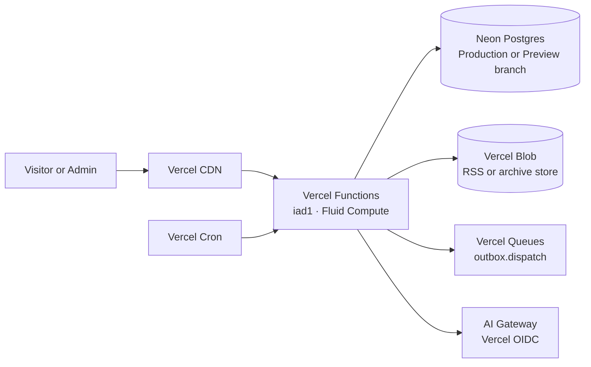

# Vercel infrastructure

This is the verified deployment record for Lions of Zion. It describes names,
boundaries and procedures, never secret values. The live project is
`lionsofzion1/lions-of-zion`, served at `https://lionsofzion.io` with `www`
redirecting to the canonical domain.

## Runtime topology

Functions use the default Fluid Compute profile (2 GB / 1 vCPU) in `iad1`.
Cron invokes ingestion, embeddings, outbox draining and daily maintenance;
the outbox is durable in Postgres before it is dispatched to Queues.

## Services and expected monthly cost

| Service | Deployed use | Expected monthly cost |
| --- | --- | ---: |
| Vercel Pro | Hosting, CDN, Functions and deployments | $20 fixed; includes $20 infrastructure credit |
| Vercel Functions | API, chat, RSS and background jobs in `iad1` | $0 expected overage |
| Neon Launch | Postgres, pgvector and Preview branches in AWS us-east-1 | $6–$15 usage-based |
| Neon Auth | One allowlisted administrator | $0 additional at this scale |
| Vercel Blob | RSS snapshots and the separate archive store | $0 expected overage |
| Vercel Queues | Reliable outbox delivery | $0 expected overage |
| Vercel Cron | Scheduled ingestion, embedding, drain and maintenance | included in Function usage |
| AI Gateway | Chat, administrative analysis and embeddings | $0–$5, hard-capped |
| Domain | Existing `lionsofzion.io` connection | no new monthly cost |

The planning range is approximately **$26–$40/month**, including Pro. Neon is
usage-based, so this is an estimate rather than a guarantee. Vercel Spend
Management is set to $10 of additional usage with alerts at 50%, 75% and
100%, without automatically disabling the site.

## Data and environment boundaries

Production uses the Neon project `lions-of-zion-db`, its main branch, and
Production Vercel Blob variables. Preview uses an isolated Neon branch and
separate RSS Blob storage. The archive store `lions-of-zion-archive` is public,
in `iad1`, and currently holds 2,018 objects (about 1.94 GB); it is never used
for RSS retention or cleanup. The two RSS stores are named
`lions-of-zion-rss-preview` and `lions-of-zion-rss-production`.

The application reads these names only; values stay in Vercel Environment
Variables:

`DATABASE_URL`, `NEON_AUTH_BASE_URL`, `NEON_AUTH_COOKIE_SECRET`, `ADMIN_EMAIL`,
`BLOB_READ_WRITE_TOKEN`, `ARCHIVE_BLOB_STORE_ID`,
`ARCHIVE_BLOB_WEBHOOK_PUBLIC_KEY`, `NEXT_PUBLIC_ARCHIVE_CDN`,
`INTERNAL_API_SECRET`, `CRON_SECRET`, `RATE_LIMIT_HMAC_SECRET`, `APP_ENV`,
`AI_DAILY_BUDGET_USD`, and `AI_MONTHLY_BUDGET_USD`.

AI Gateway uses Vercel OIDC in linked deployments; no permanent AI provider
key is required in Production. **Google Cloud and Google Vertex are not part
of this architecture.** `next/font/google` is a build-time font download, not
a Google cloud dependency.

## AI and spend controls

- Public chat uses `anthropic/claude-haiku-4.5`.
- Administrative processing uses `anthropic/claude-sonnet-5`.
- Embeddings use `openai/text-embedding-3-small` (1,536 dimensions).
- The application refuses the next request at $4.50 monthly spend; the
  Gateway ceiling is $5.
- Every completed call records the Gateway-reported cost in `ai_run`.

## Deploy and data runbook

1. Run migrations against Preview first: `npm run db:migrate` with the Preview
   `DATABASE_URL`; verify pgvector and RLS before Production.
2. Run the idempotent public import only after the Production admin exists:
   `npm run db:import-public` with Production `DATABASE_URL`, `ADMIN_EMAIL` and
   `APP_ENV=production`.
3. Build and inspect a Vercel Preview deployment. Check health, authentication,
   public search/chat, cron authorization and the `www` redirect.
4. Promote deliberately through the Vercel CLI only after Preview passes. Git
   pushes do not deploy this project automatically.
5. Roll back by aliasing the last known-good Vercel deployment; do not roll
   back database migrations destructively.

All cron handlers and queue consumers are authenticated, retry-safe and
idempotent. If the source count exceeds 50 or an RSS run approaches the
Function timeout, split ingestion into one Queue task per source.

## Verification checklist

- `/api/internal/health` reports database, Blob, AI Gateway, Neon Auth and
  internal-secret readiness without revealing values.
- Anonymous requests can use health, public search and public chat only;
  admin status and team APIs require the Neon Auth session plus database
  capabilities.
- Production contains the 21 applied migrations, one allowlisted admin and
  the ten imported public pages. Preview cannot write to those Production
  resources.
- Monitor Neon CU-hours, AI spend, Function errors, Queue age and Blob growth
  for seven days after a material deployment.
