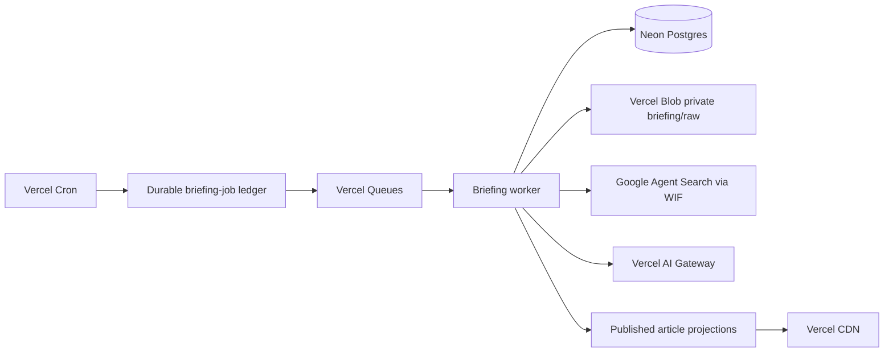

# Vercel infrastructure

This is the operational architecture for Lions of Zion. It records boundaries
and verification steps, never credentials or assumed provider state. Confirm
all identifiers and live settings in the relevant provider consoles before a
Production change.

## Briefing topology



- Direct RSS/Atom feeds and Google Agent Search supply discovery.
  Google is discovery-only and results are stored as original-publisher links.
- `openai/gpt-5-nano` performs triage; `openai/gpt-5-mini` drafts. The
  Grok public-chat profile remains independent.
- The job ledger, not queue delivery, is the idempotency authority. Every
  delivery carries only a job ID and can be retried safely.
- The Daily Brief publishes automatically in Production only after
  data-contract and quality gates pass. The database pause remains the
  immediate stop control; Preview cannot publish. The production acceptance
  sequence in `docs/briefing-operations.md` remains required operational
  evidence and must be rerun after material provider or pipeline changes.

## Environment isolation

Production and Preview must use distinct resources and declare matching labels:

```text
DATABASE_RESOURCE_ENV
BLOB_RESOURCE_ENV
QUEUE_RESOURCE_ENV
SEARCH_RESOURCE_ENV
```

Each must equal the runtime environment. `BRIEFING_BLOB_RESOURCE_ID` must not
match `OCTOBER7_BLOB_RESOURCE_ID`. Preview is forced to dry-run for briefing
collection and processing and cannot publish; the October 7 archive is outside
this pipeline and retention process.

The administrator status view also shows one-way fingerprints for the database,
briefing Blob store, October 7 archive store, Google search engine binding, and
the queue resource when `BRIEFING_QUEUE_RESOURCE_ID` is supplied.
These fingerprints are comparison aids only; they do not replace provider-side
verification of queue and search resource ownership.

Provider-side completion record:

1. Create a separate Preview database branch and record its provider resource ID.
2. Create a separate Preview Blob store and record its store ID.
3. Create separate Preview queue and search bindings; do not reuse Production
   identifiers or credentials.
4. Repeat the check for Development, or explicitly document that Development
   is local-only and has no production-connected briefing workers.
5. Compare the resulting bindings in the administrator status view, then run
   the isolated migration and restore checks before promoting code.

Current Development record: the Vercel Development environment has no
`DATABASE_URL`, briefing Blob resource, Agent Search binding, or queue binding.
It is therefore local-only and cannot start a Production-connected briefing
worker. The current Vercel environment listing also shows distinct briefing
Blob store IDs for Preview and Production, both separate from the October 7
archive store. This still does not prove Preview/Production separation for the
database, queue, or search binding; those provider-side identifiers require
verification.

## Required production configuration

Names only; see `.env.example` for the complete non-secret template.

- Neon: `DATABASE_URL`, administrator-auth settings, and the resource label.
- Vercel Blob: `BLOB_READ_WRITE_TOKEN`, briefing resource ID, and label.
- Vercel Queues: Vercel OIDC capability, region, and resource label.
- AI Gateway: Vercel OIDC or the approved local-development credential.
- Google Agent Search: project, serving configuration, Workload Identity
  Provider, service-account email, search label, hard query limit, and budget.
- Internal routes: `CRON_SECRET`, `INTERNAL_API_SECRET`, and rate-limit key.

Briefing cron and queue workers are explicitly pinned in `vercel.json` to
`iad1` and a 300-second maximum. `tests/briefing-runtime.test.ts` guards these
values; memory remains controlled by the active Vercel compute plan and must be
verified in the provider settings rather than declared through this file.

Google authentication is Vercel OIDC to Google STS to service-account
impersonation. Do not create, upload, or store a long-lived JSON key.

## Schedules and triggers

`vercel.json` owns the authoritative schedules. It includes recurring source
collection, queue/outbox recovery, maintenance/alerts, and a 07:00 Israel-time
editorial window with DST-safe UTC coverage. Each briefing queue stage has an
explicit trigger topic:

```text
briefing-collect -> enrich -> cluster -> triage -> draft -> quality -> publish
```

The Database pause can stop publication without discarding collected evidence.

## Deploy and recovery

1. Snapshot the database and Blob state before a migration or broad cleanup.
2. Apply migrations in an isolated Preview environment and run tests.
3. Verify Preview labels, no-publication behavior, and source collection.
4. Run the production acceptance sequence in `docs/briefing-operations.md`.
5. Promote only after its documented evidence exists.

For a faulty code deployment, use Vercel Instant Rollback. Database migrations
are fix-forward or restored only to an isolated database; do not remove or
reverse an applied Production migration in place. Full backup, restore,
retention, and incident procedures are in `docs/briefing-operations.md` and
`.ai/ROLLBACK.md`.
